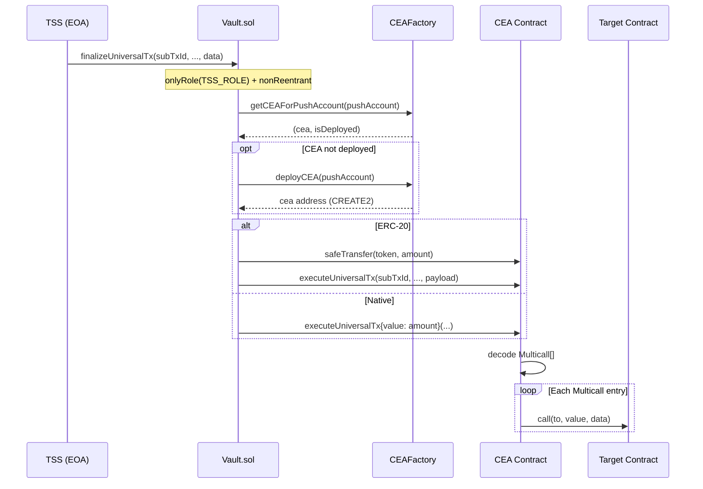
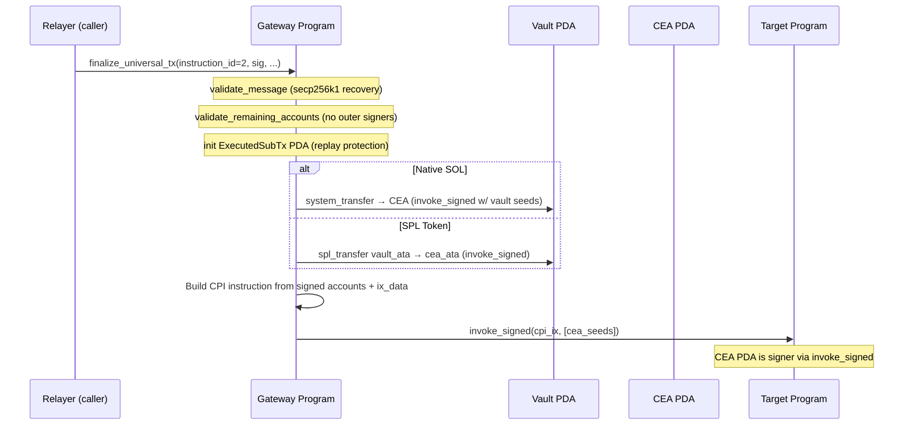
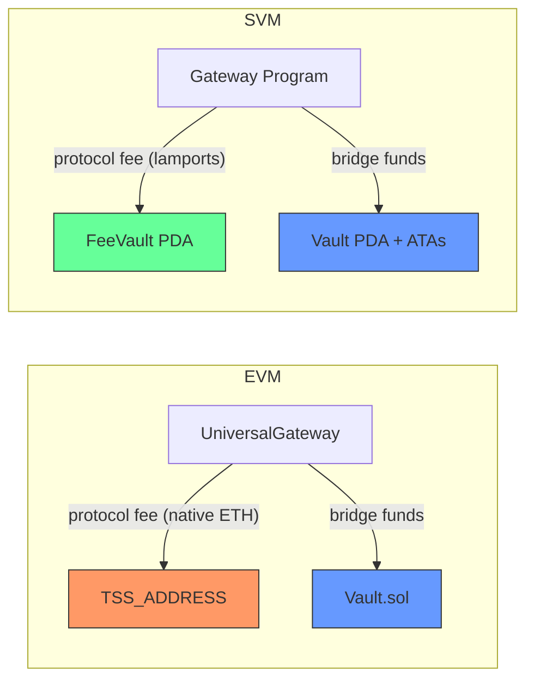

# Gateway Differential Analysis: EVM vs SVM

Scope: `UniversalGateway.sol` + `Vault.sol` (EVM) and the `universal-gateway` Anchor program (SVM). Excludes `UniversalGatewayPC` and `VaultPC`.

---

## Summary Matrix

| Area                  | EVM                                                                            | SVM                                                                                             | Audit Impact                                                                                                    |
| --------------------- | ------------------------------------------------------------------------------ | ----------------------------------------------------------------------------------------------- | --------------------------------------------------------------------------------------------------------------- |
| **TSS Authorization** | Role-based `onlyRole(TSS_ROLE)` — no on-chain sig verification                 | Full ECDSA secp256k1 on-chain recovery against stored ETH address                               | SVM: verify message reconstruction + recovery correctness. EVM: verify TSS key is the sole holder of `TSS_ROLE` |
| **Vault**             | Separate `Vault.sol` contract with its own roles, state, and reentrancy guards | SystemAccount PDA (`b"vault"`) — no code, holds SOL; ATAs hold SPL tokens                       | SVM: vault has no access control of its own — all protection is in the program                                  |
| **CEA**               | CREATE2-deployed contract per user; executes `Multicall[]` payload internally  | PDA per user (`b"push_identity" \|\| push_account`); bare signing authority via `invoke_signed` | SVM: CEA has no code — audit the CPI dispatch path. EVM: audit `Multicall` iteration and reentrancy surface     |
| **Execution Model**   | CEA iterates `Multicall[]{to, value, data}` internally                         | `invoke_signed` CPI with TSS-signed account metadata + writable flags                           | SVM: verify remaining_accounts validation prevents signer injection                                             |
| **Fee Architecture**  | Protocol fee sent to `TSS_ADDRESS` via native transfer; counter-tracked        | Separate `FeeVault` PDA; available balance = lamports - rent-exempt minimum                     | SVM: verify rent-exempt math. EVM: verify fee doesn't land in Vault                                             |
| **Replay Protection** | `isExecuted[subTxId]` mapping (bool)                                           | `ExecutedSubTx` PDA existence via Anchor `init` constraint                                      | Equivalent security. SVM: PDA creation is atomic — no TOCTOU                                                    |
| **Oracle**            | Chainlink ETH/USD + L2 sequencer check; 1e18 precision                         | Pyth SOL/USD + confidence interval; 8-decimal precision                                         | Different precision scales — verify cap comparisons match intent                                                |
| **Upgradeability**    | TransparentUpgradeableProxy (OZ) — admin can swap implementation               | Solana native program upgrade authority                                                         | EVM: storage layout compat. SVM: upgrade authority key management                                               |

---

## 1. TSS Authorization Model

On EVM, the TSS is an EOA that holds `TSS_ROLE`. Outbound functions on `Vault.sol` use the `onlyRole` modifier — no signature is verified on-chain. The trust assumption is that only the TSS multi-party computation output controls this EOA.

On SVM, there is no role system. Instead, every outbound instruction requires a full ECDSA secp256k1 signature verified on-chain via `validate_message`. The TSS ETH address is stored in the `TssPda` account and the recovered address must match exactly.

**EVM — Vault.sol:131**
```solidity
function finalizeUniversalTx(
    bytes32 subTxId,
    bytes32 universalTxId,
    address pushAccount,
    address recipient,
    address token,
    uint256 amount,
    bytes calldata data
) external payable nonReentrant whenNotPaused onlyRole(TSS_ROLE) {
```

**SVM — tss.rs:81-112**
```rust
pub fn validate_message(
    tss: &mut Account<TssPda>,
    instruction_id: u8,
    amount: Option<u64>,
    additional_data: &[&[u8]],
    message_hash: &[u8; 32],
    signature: &[u8; 64],
    recovery_id: u8,
) -> Result<()> {
    // Rebuild message: PREFIX || instruction_id || chain_id || amount || additional_data
    let mut buf = Vec::new();
    const PREFIX: &[u8] = b"PUSH_CHAIN_SVM";
    buf.extend_from_slice(PREFIX);
    buf.push(instruction_id);
    buf.extend_from_slice(tss.chain_id.as_bytes());
    if let Some(val) = amount {
        buf.extend_from_slice(&val.to_be_bytes());
    }
    for d in additional_data {
        buf.extend_from_slice(d);
    }
    let computed = hash(&buf[..]).to_bytes();
    require!(&computed == message_hash, GatewayError::MessageHashMismatch);

    // Recover signer via secp256k1
    let pubkey = secp256k1_recover(message_hash, recovery_id, signature)
        .map_err(|_| GatewayError::TssAuthFailed)?;
    let h = hash(pubkey.to_bytes().as_slice()).to_bytes();
    let address = &h.as_slice()[12..32];
    require!(address == &tss.tss_eth_address, GatewayError::TssAuthFailed);
    Ok(())
}
```

**Audit focus:**
- EVM: Verify that `TSS_ROLE` cannot be granted to additional addresses beyond the TSS. Check `setTSS` atomicity — old role is revoked before new is granted.
- SVM: Verify message reconstruction is deterministic and that all operation-specific fields are included (prevents cross-instruction replay). Verify `secp256k1_recover` uses the correct hash, not a double-hash.

---

## 2. Outbound Execution Architecture

### 2.1 Vault: Contract vs PDA

| Aspect         | EVM                                             | SVM                                                         |
| -------------- | ----------------------------------------------- | ----------------------------------------------------------- |
| Type           | Standalone upgradeable contract (`Vault.sol`)   | SystemAccount PDA: `seeds = [b"vault"]`                     |
| State          | Own storage slots, own role system              | No state — just holds SOL lamports                          |
| SPL/ERC-20     | Vault contract holds ERC-20 balances directly   | SPL tokens in ATAs owned by vault PDA                       |
| Access control | `TSS_ROLE`, `PAUSER_ROLE`, `DEFAULT_ADMIN_ROLE` | None intrinsic — all enforcement is in program instructions |
| Reentrancy     | `ReentrancyGuardUpgradeable`                    | N/A — Solana runtime prevents reentrancy                    |

**Audit focus (SVM):** Since the vault PDA has no code, any instruction that transfers from it (via `invoke_signed` with vault seeds) must be audited for authorization. The vault bump is stored in `Config` and used to derive signer seeds.

### 2.2 CEA: Deployed Contract vs PDA Signing Authority

On EVM, each user gets a deterministic contract deployed via CREATE2 through `CEAFactory`. The CEA contract receives funds and executes a `Multicall[]` payload internally.

On SVM, the CEA is a bare SystemAccount PDA — it holds no code. It acts solely as a signing authority for CPI calls via `invoke_signed`.

**EVM — Types.sol:31-35 + ICEA.sol:22-28**
```solidity
struct Multicall {
    address to;      // target contract address
    uint256 value;   // native token amount to send with call
    bytes   data;    // call data to execute
}

// CEA interface — single execution path
function executeUniversalTx(
    bytes32 subTxId,
    bytes32 universalTxId,
    address originCaller,
    address recipient,
    bytes calldata payload  // abi.encode(Multicall[])
) external payable;
```

**SVM — state.rs:11 + execute.rs:45-50, 396-416**
```rust
pub const CEA_SEED: &[u8] = b"push_identity";

// CEA PDA derivation
#[account(
    mut,
    seeds = [CEA_SEED, push_account.as_ref()],
    bump,
)]
pub cea_authority: SystemAccount<'info>,

// CPI dispatch — CEA signs via invoke_signed
let cea_key = ctx.accounts.cea_authority.key();
let cpi_metas: Vec<SolanaAccountMeta> = accounts
    .iter()
    .map(|account| {
        let is_signer = account.pubkey == cea_key;
        if account.is_writable {
            SolanaAccountMeta::new(account.pubkey, is_signer)
        } else {
            SolanaAccountMeta::new_readonly(account.pubkey, is_signer)
        }
    })
    .collect();

let cpi_ix = Instruction {
    program_id: request.target,
    accounts: cpi_metas,
    data: ix_data.to_vec(),
};
invoke_signed(&cpi_ix, ctx.remaining_accounts, &[cea_seeds])?;
```

**Audit focus:**
- EVM: Review Multicall iteration for reentrancy (CEA calls arbitrary contracts in a loop). Verify that the CEA cannot be tricked into calling back into the Vault.
- SVM: The only account that becomes a signer in CPI is `cea_authority` (matched by pubkey). Verify no other account can be injected as a signer.

### 2.3 Execution Model: Multicall vs CPI

The EVM CEA iterates an array of `Multicall` structs, making sequential external calls. The SVM program constructs a single CPI instruction with account metadata validated against TSS-signed data.

**SVM — validation.rs:17-52 (remaining_accounts validation)**
```rust
pub fn validate_remaining_accounts(
    signed_accounts: &[GatewayAccountMeta],
    remaining: &[AccountInfo],
) -> Result<()> {
    require!(
        remaining.len() == signed_accounts.len(),
        GatewayError::AccountListLengthMismatch
    );

    for (signed, actual) in signed_accounts.iter().zip(remaining.iter()) {
        require!(actual.key == &signed.pubkey, GatewayError::AccountPubkeyMismatch);

        if signed.is_writable && !actual.is_writable {
            return err!(GatewayError::AccountWritableFlagMismatch);
        }

        // CRITICAL: No outer signer allowed in target account list
        // cea_authority becomes signer only via invoke_signed, not here
        require!(!actual.is_signer, GatewayError::UnexpectedOuterSigner);
    }
    Ok(())
}
```

This is the SVM's core safety invariant for arbitrary execution: the TSS signs the exact account list and instruction data. The program verifies that `remaining_accounts` match the signed metadata, and that **no account passed by the relayer is already a signer** — preventing the relayer from injecting its own signing authority into the CPI.

| Property              | EVM                                   | SVM                                                 |
| --------------------- | ------------------------------------- | --------------------------------------------------- |
| Execution cardinality | N calls per tx (Multicall array)      | 1 CPI per tx                                        |
| Target specification  | Each Multicall entry has its own `to` | Single `destination_program`                        |
| Account list          | Implicit (EVM accounts model)         | Explicit, TSS-signed, validated                     |
| Signer control        | CEA contract is msg.sender            | CEA PDA signs via `invoke_signed`; no outer signers |

### 2.4 Outbound Flow Comparison

**EVM Outbound Flow:**



**SVM Outbound Flow:**



---

## 3. Fee Architecture

On EVM, protocol fees are collected during inbound transactions and sent directly to `TSS_ADDRESS` as a native ETH transfer. A running counter (`totalProtocolFeesCollected`) tracks cumulative fees but does not affect fund flow.

On SVM, protocol fees are collected into a dedicated `FeeVault` PDA — a separate account from the bridge vault. The available fee pool is calculated as `fee_vault.lamports - rent_exempt_minimum`, structurally isolating fee funds from bridge funds.



**EVM — UniversalGateway.sol:961-971**
```solidity
function _collectInboundFee(uint256 nativeValue)
    private returns (uint256 adjustedNative, uint256 feeCollected)
{
    uint256 fee = INBOUND_FEE;
    if (fee == 0) return (nativeValue, 0);

    if (nativeValue < fee) revert Errors.InsufficientProtocolFee();

    // Forward fee to TSS
    (bool ok,) = payable(TSS_ADDRESS).call{ value: fee }("");
    if (!ok) revert Errors.DepositFailed();

    return (nativeValue - fee, fee);
}
```

**SVM — state.rs:91-100 + transfers.rs:60-88**
```rust
// FeeVault PDA — structurally isolated from bridge vault
#[account]
pub struct FeeVault {
    pub protocol_fee_lamports: u64, // Flat fee per inbound tx; 0 disables
    pub bump: u8,
}

// Available balance = lamports above rent-exempt minimum
pub fn reimburse_relayer_from_fee_vault<'info>(
    fee_vault: &Account<'info, FeeVault>,
    caller: &AccountInfo<'info>,
    sub_tx_id: [u8; 32],
    gas_fee: u64,
) -> Result<()> {
    let fee_vault_info = fee_vault.to_account_info();
    let min_balance = Rent::get()?.minimum_balance(FeeVault::LEN);
    let available = fee_vault_info
        .lamports()
        .checked_sub(min_balance)
        .ok_or(error!(GatewayError::InsufficientFeePool))?;
    require!(available >= gas_fee, GatewayError::InsufficientFeePool);

    **fee_vault_info.try_borrow_mut_lamports()? -= gas_fee;
    **caller.try_borrow_mut_lamports()? += gas_fee;
    Ok(())
}
```

**Audit focus:**
- EVM: The fee goes to `TSS_ADDRESS` as a raw `.call{value}`. Verify this can't be used to grief inbound transactions (e.g., TSS address is a contract that reverts). Verify that the TSS address update in Vault doesn't desync from the gateway's fee recipient.
- SVM: Verify `Rent::get()?.minimum_balance(FeeVault::LEN)` uses the correct account size. An undercount would let fees eat into rent-exempt reserves, eventually making the account reclaimable.

---

## 4. Replay Protection

| Property           | EVM                                           | SVM                                                    |
| ------------------ | --------------------------------------------- | ------------------------------------------------------ |
| Mechanism          | `mapping(bytes32 => bool) isExecuted`         | `ExecutedSubTx` PDA with Anchor `init` constraint      |
| Storage            | Storage slot per subTxId                      | Account per subTxId (8 bytes discriminator only)       |
| Atomicity          | Check-then-set in same tx                     | `init` is atomic — if PDA exists, `init` fails         |
| Cost model         | ~20k gas SSTORE (cold)                        | Rent-exempt deposit (~890 lamports for 8-byte account) |
| Revert/rescue path | Shared `isExecuted` in `UniversalGateway.sol` | Separate `ExecutedSubTx` PDA per subTxId               |
| Cleanup            | Permanent — mapping entries are never deleted | Permanent — PDA accounts persist                       |

Both implementations provide equivalent replay protection. The SVM approach is marginally safer against TOCTOU because Anchor's `init` constraint makes PDA creation and existence-check atomic within the runtime.

---

## 5. Oracle Integration

| Property            | EVM                                                                | SVM                                                                      |
| ------------------- | ------------------------------------------------------------------ | ------------------------------------------------------------------------ |
| Provider            | Chainlink (AggregatorV3Interface)                                  | Pyth (PriceUpdateV2)                                                     |
| Feed                | ETH/USD                                                            | SOL/USD                                                                  |
| Precision           | 1e18 (normalized from feed decimals)                               | 8 decimals (Pyth native)                                                 |
| Staleness check     | `chainlinkStalePeriod` (default 1h); `block.timestamp - updatedAt` | `MAX_PRICE_AGE_SECONDS` = 3600; `get_price_no_older_than`                |
| L2 sequencer check  | Yes — `l2SequencerFeed` status + grace period                      | N/A (no L2 concept on Solana)                                            |
| Confidence interval | Not checked                                                        | `pyth_confidence_threshold` — if > 0, `confidence <= threshold` required |
| Round validation    | `answeredInRound >= roundId`, `priceInUSD > 0`                     | `price > 0`                                                              |
| USD cap comparison  | `quoteEthAmountInUsd1e18()` vs 1e18-scaled caps                    | `calculate_usd_amount()` vs 8-decimal caps                               |

**Audit focus:**
- EVM: Verify `chainlinkEthUsdDecimals` fallback logic doesn't silently use 0 decimals. Verify L2 sequencer grace period is sufficient for the target L2.
- SVM: Verify exponent handling in `calculate_usd_amount` — the `exponent_adjustment = exponent + 8` path could overflow/underflow for non-standard feeds. Verify confidence threshold is set to a meaningful value in production (0 disables the check).

---

## 6. Rent Exemption (SVM-only)

Solana accounts must maintain a minimum lamport balance to remain rent-exempt. This affects two security-relevant areas:

**Fee vault available balance:**
The `reimburse_relayer_from_fee_vault` function computes available funds as `lamports - Rent::get()?.minimum_balance(FeeVault::LEN)`. If `FeeVault::LEN` is incorrect (currently `8 + 8 + 1 + 50 = 67`), the rent floor could be miscalculated, either blocking reimbursements or allowing the account to drop below rent exemption.

**Vault transfer constraints:**
The vault PDA (SystemAccount) must also remain rent-exempt after transfers. The `pda_system_transfer` function uses `system_instruction::transfer` which will fail at the runtime level if the source account drops below rent-exempt minimum. This is a built-in Solana safety net, but auditors should verify that no path attempts to drain the vault PDA to exactly 0 lamports.

---

## 7. Upgradeability

| Property      | EVM                                                      | SVM                                                              |
| ------------- | -------------------------------------------------------- | ---------------------------------------------------------------- |
| Pattern       | TransparentUpgradeableProxy (OpenZeppelin)               | Solana native `BPFUpgradeableLoader`                             |
| Admin         | ProxyAdmin contract (separate from protocol admin)       | Program upgrade authority (single Pubkey)                        |
| Storage risk  | Storage layout must be preserved across upgrades         | Account layout must be preserved (discriminator + fields)        |
| Pause upgrade | No built-in mechanism — ProxyAdmin owner must be secured | `solana program set-upgrade-authority --final` to make immutable |
| Rollback      | Deploy previous implementation and upgrade again         | Redeploy previous program binary                                 |

---

## 8. Platform-Specific Features

**Gas token swap via Uniswap V3 (EVM-only):**
`UniversalGateway.sol` integrates Uniswap V3 for ERC-20 to native gas conversion on inbound. The `swapToNative` function scans fee tiers to find a valid pool. This has no SVM equivalent — SVM inbound only accepts native SOL.

**Outbound instruction ID routing (SVM):**
The SVM `finalize_universal_tx` uses an `instruction_id` parameter to route between withdraw (1) and execute (2) within a single entrypoint. The EVM equivalent uses separate functions on Vault (`finalizeUniversalTx` for both, with empty `data` implying withdraw). SVM also has separate top-level instructions for revert (3) and rescue (4), while EVM has separate `revertUniversalTx` and `rescueFunds` functions on Vault.

| Instruction ID | SVM Operation                           | EVM Equivalent                                     |
| -------------- | --------------------------------------- | -------------------------------------------------- |
| 1              | Withdraw (via `finalize_universal_tx`)  | `Vault.finalizeUniversalTx` with empty `data`      |
| 2              | Execute (via `finalize_universal_tx`)   | `Vault.finalizeUniversalTx` with Multicall payload |
| 3              | Revert (separate `revert_universal_tx`) | `Vault.revertUniversalTx`                          |
| 4              | Rescue (separate `rescue_funds`)        | `Vault.rescueFunds`                                |
