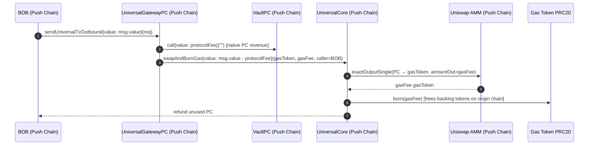

# UniversalGatewayPC — Outbound Gateway Overview

**UniversalGatewayPC** is the outbound gateway deployed **only on Push Chain**. It handles user requests to exit Push Chain back to an origin chain by burning PRC20 tokens and optionally attaching execution payloads.

Gas fees are paid in native PC, swapped to the origin chain's gas token PRC20 via UniversalCore. The gas-cost portion (`gasFee`) is **burned** — freeing the backing tokens for TSS relayers to spend on origin-chain gas. The protocol-fee portion (`protocolFee`) is collected as **native PC** and sent directly to **VaultPC** before the swap. Unused PC is refunded directly to the caller.

---

## 1. Contract Layout

| Section                       | Description                                           |
| ----------------------------- | ----------------------------------------------------- |
| **UGPC_1: Admin Actions**     | `initialize`, `pause`/`unpause`, `setVaultPC`, `setRescueFundsGasLimit` |
| **UGPC_2: Outbound TX**       | `sendUniversalTxOutbound`, `rescueFundsOnSourceChain`                    |
| **UGPC_3: Internal Helpers**  | TX_TYPE inference, fee quoting, swap+burn, PRC20 burn |
| **UGPC_3: View Functions** *(interface)* | `UNIVERSAL_CORE()` view accessor           |

---

## 2. `sendUniversalTxOutbound` — Entry Point

`sendUniversalTxOutbound(UniversalOutboundTxRequest calldata req)` is the single public entry point. It is `payable` (native PC for gas fees), `whenNotPaused`, and `nonReentrant`.

**Execution flow:**

1. **Validate** — `token` must be non-zero, `revertRecipient` must be non-zero.
2. **Infer TX_TYPE** — via `_fetchTxType(req)` based on payload and amount presence.
3. **Quote fees** — via `_fetchOutboundTxGasAndFees(req.token, req.gasLimit)` returning `gasToken`, `gasFee`, `gasLimitUsed`, `protocolFee`, `gasPrice`, and `chainNamespace`.
4. **Burn PRC20** — if `amount > 0`, pulls and burns the user's PRC20 tokens.
5. **Collect protocol fee** — sends `protocolFee` (native PC) directly to VaultPC via low-level call.
6. **Swap and burn gas** — swaps remaining `msg.value - protocolFee` (native PC) to gas token PRC20 via `UniversalCore.swapAndBurnGas()`:
   - `gasFee` worth of gas token is **burned** (supply freed for TSS relayers).
   - Unused PC is **refunded** to the caller.
6. **Generate subTxId** — `keccak256(sender, recipient, token, amount, payloadHash, chainNamespace, nonce)`.
7. **Emit `UniversalTxOutbound`** — contains all data for relayers/executors.

---

### 2.1 TX_TYPE Inference (`_fetchTxType`)

The gateway infers `TX_TYPE` from two decision variables — users never specify it explicitly:

| hasPayload | hasFunds (`amount > 0`) | TX_TYPE             | Behavior                                           |
| ---------- | ----------------------- | ------------------- | -------------------------------------------------- |
| NO         | YES                     | `FUNDS`             | Burn tokens, unlock on origin chain                |
| YES        | YES                     | `FUNDS_AND_PAYLOAD` | Burn tokens + execute payload on origin chain      |
| YES        | NO                      | `GAS_AND_PAYLOAD`   | Execute payload using existing CEA funds (no burn) |
| NO         | NO                      | —                   | Reverts with `InvalidInput` (empty transaction)    |

`GAS_AND_PAYLOAD` enables payload-only transactions where the user's CEA on the origin chain already holds sufficient funds for execution.

---

### 2.2 Fee Quoting (`_fetchOutboundTxGasAndFees`)

Fetches gas fee quote and chain metadata from `UniversalCore.getOutboundTxGasAndFees(token, gasLimitUsed)`:

- **`gasLimitUsed`** — if `req.gasLimit == 0`, defaults to `UniversalCore.BASE_GAS_LIMIT()`.
- **`gasToken`** — the PRC20 gas token for the target chain (e.g., pETH for Ethereum).
- **`gasFee`** — gas cost only: `gasPrice * gasLimit`. Excludes protocol fee.
- **`protocolFee`** — flat protocol fee in native PC (from `UniversalCore.protocolFeeByToken` mapping).
- **`gasPrice`** — gas price on the external chain (wei per gas unit).
- **`chainNamespace`** — chain identifier string for the target chain.

Reverts with `InvalidData` if `gasToken == address(0)` or `gasFee + protocolFee == 0`.

---

### 2.3 Fee Swap and Split (`_swapAndCollectFees`)

**Protocol Fee vs Gas Fee**:

| Property | Protocol Fee | Gas Fee |
|----------|--------------|---------|
| What it is | Flat revenue fee per outbound tx | Cost to execute the tx on the origin chain |
| Denomination | Native PC | Gas token PRC20 (e.g., pETH for Ethereum) |
| Destination | VaultPC (sent before swap) | Burned via UniversalCore |
| Source | `UniversalCore.getOutboundTxGasAndFees` | `gasPrice × gasLimit` |
| Refund on over-payment | No (exact amount sent to VaultPC) | Yes — unused PC refunded to caller |

**Detailed flow**:

1. UGPC sends `protocolFee` (native PC) directly to VaultPC via `call{value: protocolFee}("")`.
2. UGPC calls `UniversalCore.swapAndBurnGas{value: msg.value - protocolFee}(gasToken, fee, gasFee, deadline, caller)`.
3. UniversalCore performs an `exactOutputSingle` swap: native PC → gas token PRC20.
4. Exactly `gasFee` worth of gas token PRC20 is **burned** — the backing tokens on the origin chain are freed for TSS relayers to spend on execution gas.
5. Any excess native PC is **refunded** directly to `caller` (the original user) by UniversalCore.

---

### 2.4 PRC20 Burn (`_burnPRC20`)

When `amount > 0`, the gateway:

1. Pulls `amount` PRC20 from the user into itself via `transferFrom`.
2. Burns the PRC20 via `burn(amount)`.

The gateway never custodies withdrawn value — burning is the canonical on-chain representation of "exit requested". For `GAS_AND_PAYLOAD` (amount = 0), the burn step is skipped entirely.

---

## 2b. `rescueFundsOnSourceChain` — Rescue Path

`rescueFundsOnSourceChain(bytes32 universalTxId, address prc20)` allows a user on Push Chain to request that TSS releases funds stuck in a source chain's Vault.

**When to use:** When tokens were locked in a Vault via `sendUniversalTxFromCEA` but never minted on Push Chain (edge case).

**Execution flow:**

1. **Validate** — `prc20 != address(0)`.
2. **Resolve chain and quote gas** — calls `IUniversalCore(UNIVERSAL_CORE).getRescueFundsGasLimit(prc20)` which returns: `gasToken`, `gasFee`, `rescueGasLimit`, `gasPrice`, `chainNamespace`.
3. **Swap and burn** — all `msg.value` goes to `_swapAndCollectFees(gasToken, msg.value, gasFee)` (no protocol fee split).
4. **Emit `RescueFundsOnSourceChain`** — TSS picks this up and calls `Vault.rescueFunds()` on the source chain.

**Key differences from `sendUniversalTxOutbound`:**
- No PRC20 burn (tokens are stuck, not held by the user).
- No protocol fee.
- No nonce or subTxId.
- Fixed gas limit via `RESCUE_FUNDS_GAS_LIMIT` (admin-configurable).
- Emits `TX_TYPE.RESCUE_FUNDS` (value 4).

**Storage variable:** `RESCUE_FUNDS_GAS_LIMIT` — set via `setRescueFundsGasLimit(uint256)` (admin only, whenNotPaused).

---

## 3. Access Control

| Role                 | Permissions                                             |
| -------------------- | ------------------------------------------------------- |
| `DEFAULT_ADMIN_ROLE` | `initialize`, `setVaultPC`, `setRescueFundsGasLimit`    |
| `PAUSER_ROLE`        | `pause`, `unpause`                                      |

---

## 4. Key Interfaces

| Interface        | Function                                                                      | Purpose                                                     |
| ---------------- | ----------------------------------------------------------------------------- | ----------------------------------------------------------- |
| `IUniversalCore` | `BASE_GAS_LIMIT()`                                                            | Default gas limit when user passes 0                        |
| `IUniversalCore` | `getOutboundTxGasAndFees(token, gasLimit)`                                    | Quote gas fee, protocol fee, gas price, gas token, chain namespace |
| `IUniversalCore` | `swapAndBurnGas(gasToken, fee, gasFee, deadline, caller)`                     | Swap PC → gas token, burn gasFee, refund unused PC to caller |
| `IUniversalCore` | `getRescueFundsGasLimit(prc20)`                                               | Resolve chain and quote gas for `rescueFundsOnSourceChain`  |
| `IPRC20`         | `transferFrom`, `burn`                                                        | Pull/burn PRC20 tokens                                      |
| `IVaultPC`       | (address only)                                                                | Receives protocol fee in native PC                          |
