# Outbound Transaction Flows v2

This document describes all valid outbound transaction flows in the CEA-mediated architecture.
"Outbound" means: a user on Push Chain initiates a transaction that results in execution on an
external EVM chain (Ethereum, Base, Arbitrum, etc.).

---

## 1. Architecture Overview

### 1.1 Chain Roles and Contract Placement

| Chain          | Contract             | Role                                                                |
| -------------- | -------------------- | ------------------------------------------------------------------- |
| Push Chain     | `UniversalGatewayPC` | Outbound entry point; infers TX_TYPE; burns PRC20; collects fees    |
| Push Chain     | `VaultPC`            | Receives gas fees from outbound requests                            |
| External Chain | `Vault`              | TSS-controlled custody; deploys/funds CEA; calls executeUniversalTx |
| External Chain | `CEAFactory`         | Deterministic CREATE2 deployer for CEA contracts                    |
| External Chain | `CEA`                | Per-UEA smart contract wallet; executes multicall payloads          |
| External Chain | `UniversalGateway`   | Inbound entry point; handles CEA→UEA self-calls; processes reverts  |

### 1.2 Actors

| Actor   | Description                                                                                                                                                  |
| ------- | ------------------------------------------------------------------------------------------------------------------------------------------------------------ |
| **BOB** | The end user. Has a UEA (Universal Execution Account) on Push Chain and an associated CEA on the external chain.                                             |
| **UEA** | BOB's account on Push Chain — the address from which he calls `sendUniversalTxOutbound`.                                                                     |
| **TSS** | Off-chain Threshold Signature Scheme relayer operated by Push Chain validators. Observes `UniversalTxOutbound` events and calls `Vault.finalizeUniversalTx`. |
| **CEA** | BOB's Chain Execution Account on the external chain. Deterministically derived from BOB's UEA address. Holds tokens and executes multicalls on BOB's behalf. |

### 1.3 Token Model: PRC20 Burn/Mint Mechanics

PRC20 tokens are wrapped representations of external chain tokens on Push Chain.

- **Outbound (withdrawal)**: BOB holds PRC20 tokens on Push Chain. When `amount > 0`, `UniversalGatewayPC` burns them via `_burnPRC20`. The corresponding native tokens are released from `Vault` on the external chain.
- **Gas fee**: Always collected in PRC20 (or designated gas token) via `_moveFees → VaultPC`. Collected regardless of whether `amount > 0`.
- **Inbound (deposit)**: Out of scope for this document — see inbound flow docs.

### 1.4 TX_TYPE Reference

#### Push Chain (`UniversalGatewayPC._fetchTxType`)

Source: `src/UniversalGatewayPC.sol:139-160`

| `req.payload` | `req.amount` | TX_TYPE             | PRC20 Burn | Description                                |
| ------------- | ------------ | ------------------- | ---------- | ------------------------------------------ |
| empty         | > 0          | `FUNDS`             | yes        | Pure withdrawal — deliver tokens to target |
| non-empty     | > 0          | `FUNDS_AND_PAYLOAD` | yes        | Withdraw + execute on external chain       |
| non-empty     | == 0         | `GAS_AND_PAYLOAD`   | no         | Execute using pre-existing CEA balance     |
| empty         | == 0         | ❌ reverts           | —          | Empty transaction, rejected                |

#### External Chain (`UniversalGateway._fetchTxType`, used for CEA→UEA self-calls)

| `msg.value` | `req.token/amount` | `req.payload` | TX_TYPE             | Route    |
| ----------- | ------------------ | ------------- | ------------------- | -------- |
| > 0         | none               | empty         | `GAS`               | Instant  |
| any         | none               | non-empty     | `GAS_AND_PAYLOAD`   | Instant  |
| 0           | token, amount > 0  | empty         | `FUNDS`             | Standard |
| any         | token, amount > 0  | non-empty     | `FUNDS_AND_PAYLOAD` | Standard |

### 1.5 Multicall Payload: The CEA Execution Engine

All CEA operations use the `Multicall[]` structure:

```solidity
struct Multicall {
    address to;      // Target contract address
    uint256 value;   // Native token amount to forward with this call
    bytes data;      // ABI-encoded call data
}

// Encoding:
bytes memory payload = abi.encode(multicallArray);
```

**Key execution rules** (from `CEA_temp.sol:182-207`):
- Each call in the array executes sequentially.
- No strict enforcement that `sum(call.value) == msg.value` — CEA may spend pre-existing balance in addition to Vault-supplied value.
- Self-calls to CEA (`to == address(this)`) must have `value == 0`.
- If any call reverts, the entire execution reverts.
- **Empty payload** (`data = bytes("")`): CEA holds funds, nothing executed.

### 1.6 Funding Sources: BURN vs CEA Balance vs Hybrid

Users can either use 3 main routes for any outbound executions ( Push Chain to Source Chain )
1. Traditional Burn_And_Withdraw route: Burn Token on Push Chain, Release Token on Source.
2. CEA Balance: If User's CEA balance on source has enough tokens, then just move payload and use CEA balance for execution.
3. Hybrid: Use both CEA + Burnt Token to get get required token on source.


| Mechanism       | When used                                         | What happens on Push Chain                          |
| --------------- | ------------------------------------------------- | --------------------------------------------------- |
| **BURN only**   | `req.amount > 0` in `sendUniversalTxOutbound`     | PRC20 burned; Vault releases tokens                 |
| **CEA balance** | `req.amount == 0` (GAS_AND_PAYLOAD)               | No burn; CEA uses its existing funds                |
| **Hybrid**      | CEA multicall includes token transfer + execution | CEA spends pre-held balance + Vault-supplied amount |

---

## 2. Category 1 — Withdrawal Flows

These flows deliver tokens to an address on the external chain. The TSS crafts a multicall
containing a transfer call so the CEA forwards tokens to the intended recipient.

---

### 2.1 Native Withdrawal WITH BURN

**Scenario**: BOB has 1 ETH worth of PRC20-ETH on Push Chain and wants to withdraw 1 ETH
to `recipientAddress` on Ethereum.

**Preconditions**:
- BOB holds ≥ `amount` PRC20-ETH on Push Chain
- BOB has approved `UniversalGatewayPC` for `gasFee` in `gasToken`
- BOB has approved `UniversalGatewayPC` for `amount` in PRC20-ETH
- Vault holds ≥ `amount` in native ETH

**Push Chain call** (`sendUniversalTxOutbound`):
```solidity
UniversalOutboundTxRequest({
    target:          abi.encode(recipientAddress),  // bytes — recipient on Ethereum
    token:           PRC20_ETH,                     // PRC20 for native ETH
    amount:          1 ether,
    gasLimit:        0,                              // use BASE_GAS_LIMIT
    payload:         bytes(""),                      // empty = FUNDS type
    revertRecipient: BOB_PUSH_ADDRESS
})
```

**TX_TYPE inferred**: `FUNDS` — `amount > 0`, `payload` empty.

**UniversalGatewayPC actions**:
1. `_validateCommon`: validates `target`, `token`, `revertRecipient`
2. `_fetchTxType`: returns `TX_TYPE.FUNDS`
3. `_calculateGasFeesWithLimit`: queries `UniversalCore` for `gasToken` and `gasFee`
4. `_moveFees(BOB, gasToken, gasFee)`: transfers gas fee from BOB to VaultPC
5. `_burnPRC20(BOB, PRC20_ETH, 1 ether)`: pulls PRC20 from BOB, burns it
6. Emits `UniversalTxOutbound(subTxId, BOB, "eip155:1", PRC20_ETH, target, 1 ether, ...)`

**TSS action**: Observes `UniversalTxOutbound` event. Constructs and signs
`Vault.finalizeUniversalTx` call with a multicall payload that transfers 1 ETH to `recipientAddress`.

**Vault actions** (`finalizeUniversalTx`, `Vault.sol:151-171`):
1. `getCEAForPushAccount(BOB_UEA)` → returns `(CEA_ADDR, isDeployed)`
2. If not deployed: `CEAFactory.deployCEA(BOB_UEA)` → deploys new CEA via CREATE2
3. `_validateParams`: confirms `token == address(0)` and `msg.value == amount`
4. Calls `ICEA(cea).executeUniversalTx{value: 1 ether}(subTxId, universalTxId, BOB_UEA, data)`
5. Emits `VaultUniversalTxFinalized`

**TSS-crafted multicall payload** (`data`):
```solidity
Multicall[] memory calls = new Multicall[](1);
calls[0] = Multicall({
    to:    recipientAddress,
    value: 1 ether,
    data:  bytes("")          // plain ETH transfer
});
bytes memory data = abi.encode(calls);
```

**CEA execution**:
- Receives 1 ETH via `{value: 1 ether}` in the Vault call
- Executes `recipientAddress.call{value: 1 ether}("")`
- `recipientAddress` receives 1 ETH

**Final state**:
- BOB's PRC20-ETH balance: reduced by `amount + gasFee`
- `recipientAddress` on Ethereum: +1 ETH
- CEA native balance: unchanged (received and forwarded)

**Constraints/errors**:
- `token == address(0)` but `msg.value != amount` → `InvalidAmount()`
- Vault ETH balance < `amount` → `InvalidAmount()` (or call reverts)
- PRC20 burn fails → `TokenBurnFailed(token, amount)`

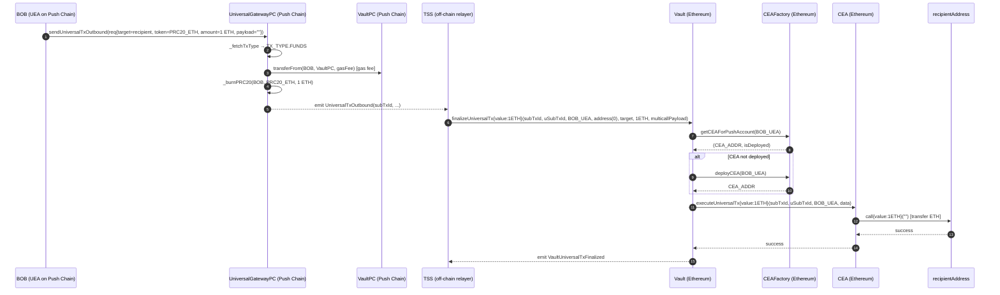

---

### 2.2 Native Withdrawal WITHOUT BURN (move ETH from CEA to UEA)

**Scenario**: BOB's CEA already holds ETH from a previous execution. BOB wants to retrieve
that ETH back to his UEA on Push Chain, without burning additional PRC20.

**Preconditions**:
- CEA holds ≥ `ceaEthAmount` ETH
- BOB holds `gasFee` in `gasToken` on Push Chain (for the outbound fee)
- BOB has approved `UniversalGatewayPC` for the gas fee

**Push Chain call**:
```solidity
UniversalOutboundTxRequest({
    target:          abi.encode(GATEWAY_ADDRESS),  // UniversalGateway on Ethereum
    token:           PRC20_ETH,
    amount:          0,                             // NO burn
    gasLimit:        0,
    payload:         sendUniversalTxCalldata,       // non-empty = GAS_AND_PAYLOAD
    revertRecipient: BOB_PUSH_ADDRESS
})
```

Where `sendUniversalTxCalldata` encodes a call to `UniversalGateway.sendUniversalTxFromCEA`
with a `GAS` request for `ceaEthAmount`.

**TX_TYPE inferred**: `GAS_AND_PAYLOAD` — `amount == 0`, `payload` non-empty.

**UniversalGatewayPC actions**:
1. `_fetchTxType`: returns `TX_TYPE.GAS_AND_PAYLOAD`
2. Collects gas fee; **no PRC20 burn** (amount == 0)
3. Emits `UniversalTxOutbound(subTxId, BOB, ..., amount=0, payload=..., txType=GAS_AND_PAYLOAD)`

**TSS action**: Observes event. Calls `Vault.finalizeUniversalTx` with `amount=0` and
a multicall payload targeting `UniversalGateway.sendUniversalTxFromCEA`.

**Vault actions**:
1. Gets/deploys CEA for BOB_UEA
2. `_validateParams`: `token == address(0)` and `msg.value == 0` → valid
3. Calls `ICEA(cea).executeUniversalTx{value: 0}(subTxId, uSubTxId, BOB_UEA, data)`

**TSS-crafted multicall payload**:
```solidity
// CEA sends its own ETH to UniversalGateway as a GAS top-up for BOB's UEA
UniversalTxRequest memory req = UniversalTxRequest({
    recipient:       BOB_UEA,         // mapped UEA — fromCEA requires explicit recipient
    token:           address(0),
    amount:          ceaEthAmount,    // ETH held in CEA to send
    payload:         bytes(""),
    revertRecipient: BOB_PUSH_ADDRESS,
    signatureData:   bytes("")
});

Multicall[] memory calls = new Multicall[](1);
calls[0] = Multicall({
    to:    UNIVERSAL_GATEWAY,
    value: ceaEthAmount,
    data:  abi.encodeCall(IUniversalGateway.sendUniversalTxFromCEA, (req))
});
bytes memory data = abi.encode(calls);
```

**CEA execution**:
- Calls `UniversalGateway.sendUniversalTxFromCEA{value: ceaEthAmount}(req)`
- Gateway validates: `isCEA(CEA)` ✓, `getUEAForCEA(CEA) == BOB_UEA` ✓, `req.recipient == BOB_UEA` ✓
- Gateway infers `TX_TYPE.GAS`; emits `UniversalTx(sender=CEA, recipient=BOB_UEA, amount=ceaEthAmount, fromCEA=true)`
- Push Chain mints gas to BOB's UEA

**Final state**:
- CEA ETH balance: reduced by `ceaEthAmount`
- BOB's UEA gas on Push Chain: increased
- BOB's PRC20-ETH: unchanged (no burn)

> **fromCEA semantics**: `fromCEA=true` and `recipient=BOB_UEA` are required so Push Chain
> credits BOB's actual UEA. Without this, Push Chain would deploy a new UEA for the CEA address.

**Constraints/errors**:
- CEA ETH balance < `ceaEthAmount` → `ExecutionFailed()`
- `req.recipient != mappedUEA` → `InvalidRecipient()` in gateway
- `isCEA(caller) == false` → `InvalidInput()` in gateway

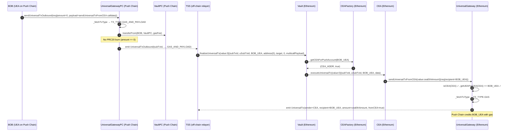

---

### 2.3 Token Withdrawal WITH BURN

**Scenario**: BOB holds PRC20-USDC on Push Chain and wants to withdraw 1000 USDC
to `recipientAddress` on Ethereum.

**Preconditions**:
- BOB holds ≥ `amount` PRC20-USDC and ≥ `gasFee` in `gasToken`
- BOB has approved `UniversalGatewayPC` for both
- Vault holds ≥ `amount` in USDC (ERC20)

**Push Chain call**:
```solidity
UniversalOutboundTxRequest({
    target:          abi.encode(recipientAddress),
    token:           PRC20_USDC,
    amount:          1000e6,          // 1000 USDC (6 decimals)
    gasLimit:        0,
    payload:         bytes(""),
    revertRecipient: BOB_PUSH_ADDRESS
})
```

**TX_TYPE inferred**: `FUNDS`

**UniversalGatewayPC actions**:
1. Collects gas fee in `gasToken`
2. Burns 1000e6 PRC20-USDC from BOB
3. Emits `UniversalTxOutbound`

**Vault actions**:
1. Gets/deploys CEA for BOB_UEA
2. `_validateParams`: `token != address(0)` and `msg.value == 0` → valid
3. Transfers 1000e6 USDC to CEA: `IERC20(USDC).safeTransfer(cea, 1000e6)`
4. Calls `ICEA(cea).executeUniversalTx(subTxId, uSubTxId, BOB_UEA, data)` (no value)

**TSS-crafted multicall payload**:
```solidity
Multicall[] memory calls = new Multicall[](1);
calls[0] = Multicall({
    to:    USDC_ADDRESS,
    value: 0,
    data:  abi.encodeCall(IERC20.transfer, (recipientAddress, 1000e6))
});
bytes memory data = abi.encode(calls);
```

**CEA execution**:
- Calls `USDC.transfer(recipientAddress, 1000e6)`
- `recipientAddress` receives 1000 USDC

**Final state**:
- BOB's PRC20-USDC: reduced by `amount + gasFee`
- `recipientAddress` on Ethereum: +1000 USDC
- CEA USDC balance: unchanged (received and forwarded)

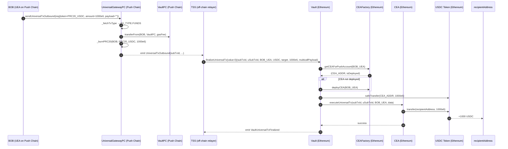

---

### 2.4 Token Withdrawal WITHOUT BURN (move ERC20 from CEA back to UEA)

**Scenario**: BOB's CEA holds USDC from a previous operation. BOB wants to send it
back to his UEA on Push Chain as PRC20-USDC without burning additional tokens.

This is a `GAS_AND_PAYLOAD` flow — the multicall instructs CEA to approve the gateway,
then call `sendUniversalTxFromCEA` with the USDC.

**Preconditions**:
- CEA holds ≥ `ceaUsdcAmount` USDC
- BOB holds gas fee on Push Chain

**Push Chain call**: `amount=0`, non-empty `payload` → `TX_TYPE.GAS_AND_PAYLOAD`

**TSS-crafted multicall payload**:
```solidity
Multicall[] memory calls = new Multicall[](2);
// Step 1: CEA approves UniversalGateway to pull USDC
calls[0] = Multicall({
    to:    USDC_ADDRESS,
    value: 0,
    data:  abi.encodeCall(IERC20.approve, (UNIVERSAL_GATEWAY, ceaUsdcAmount))
});
// Step 2: CEA calls sendUniversalTxFromCEA (gateway pulls USDC via safeTransferFrom)
calls[1] = Multicall({
    to:    UNIVERSAL_GATEWAY,
    value: 0,
    data:  abi.encodeCall(IUniversalGateway.sendUniversalTxFromCEA, (UniversalTxRequest({
        recipient:       BOB_UEA,
        token:           USDC_ADDRESS,
        amount:          ceaUsdcAmount,
        payload:         bytes(""),
        revertRecipient: BOB_PUSH_ADDRESS,
        signatureData:   bytes("")
    })))
});
bytes memory data = abi.encode(calls);
```

> **ERC20 self-call pattern**: For ERC20 tokens, the CEA must approve the gateway before
> calling `sendUniversalTxFromCEA`. The gateway's `_handleDeposits` uses `safeTransferFrom(CEA, Vault, amount)`.
> The approve + sendUniversalTxFromCEA calls must be consecutive in the multicall.

**CEA execution**:
1. Approves gateway for `ceaUsdcAmount` USDC
2. Calls `sendUniversalTxFromCEA` — gateway validates CEA identity, infers `TX_TYPE.FUNDS`
3. Gateway pulls USDC from CEA via `safeTransferFrom` into Vault
4. Emits `UniversalTx(sender=CEA, recipient=BOB_UEA, token=USDC, amount=ceaUsdcAmount, fromCEA=true)`
5. Push Chain mints PRC20-USDC to BOB's UEA

**Final state**:
- CEA USDC balance: reduced by `ceaUsdcAmount`
- BOB's PRC20-USDC on Push Chain: increased
- No PRC20 burned

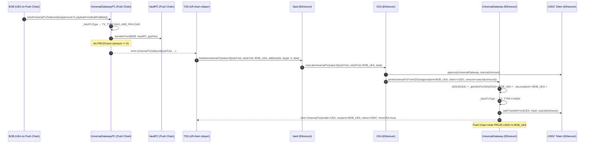

---

## 3. Category 2 — DeFi / Arbitrary Execution Flows

These flows execute arbitrary contract calls on the external chain. The multicall payload
contains the specific protocol interactions BOB wants to perform.

---

### 3.1 Execute with Native via BURN only

**Scenario**: BOB burns 1 ETH worth of PRC20-ETH and executes a Uniswap swap on Ethereum,
using those funds directly in the swap.

**Preconditions**:
- BOB holds ≥ 1 ETH PRC20-ETH and gas fee
- Vault holds ≥ 1 ETH native

**Push Chain call**:
```solidity
UniversalOutboundTxRequest({
    target:          abi.encode(UNISWAP_ROUTER),
    token:           PRC20_ETH,
    amount:          1 ether,
    gasLimit:        300_000,
    payload:         uniswapCalldata,   // non-empty = FUNDS_AND_PAYLOAD
    revertRecipient: BOB_PUSH_ADDRESS
})
```

**TX_TYPE inferred**: `FUNDS_AND_PAYLOAD` — `amount > 0`, `payload` non-empty.

**TSS-crafted multicall payload**:
```solidity
Multicall[] memory calls = new Multicall[](1);
calls[0] = Multicall({
    to:    UNISWAP_ROUTER,
    value: 1 ether,
    data:  abi.encodeCall(IUniswapRouter.exactInputSingle, (swapParams))
});
bytes memory data = abi.encode(calls);
```

**Vault actions**:
1. Calls `ICEA(cea).executeUniversalTx{value: 1 ether}(...)` — CEA receives 1 ETH

**CEA execution**:
- Calls `UniswapRouter.exactInputSingle{value: 1 ether}(swapParams)`
- Swap output tokens arrive in CEA

**Final state**:
- BOB's PRC20-ETH: reduced by `1 ether + gasFee`
- CEA: holds swap output tokens (e.g., USDC)
- Uniswap: executed swap

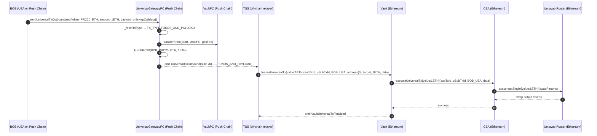

---

### 3.2 Execute with Native via CEA Balance only (no burn)

**Scenario**: BOB's CEA already holds 0.5 ETH from a prior deposit. BOB wants to
use that ETH to call a contract on Ethereum without burning any PRC20 on Push Chain.

**Push Chain call**: `amount=0`, non-empty payload → `TX_TYPE.GAS_AND_PAYLOAD`

**TSS-crafted multicall payload**:
```solidity
Multicall[] memory calls = new Multicall[](1);
calls[0] = Multicall({
    to:    TARGET_CONTRACT,
    value: 0.5 ether,        // from CEA's existing balance
    data:  targetCalldata
});
bytes memory data = abi.encode(calls);
```

**Vault actions**:
- `finalizeUniversalTx{value:0}` — sends no ETH to CEA
- CEA already holds 0.5 ETH from before

**CEA execution**:
- Uses pre-existing 0.5 ETH balance to call target
- No Vault-supplied value used

**Final state**:
- CEA ETH: reduced by 0.5 ETH
- BOB's PRC20: unchanged (no burn)
- Target contract: executed

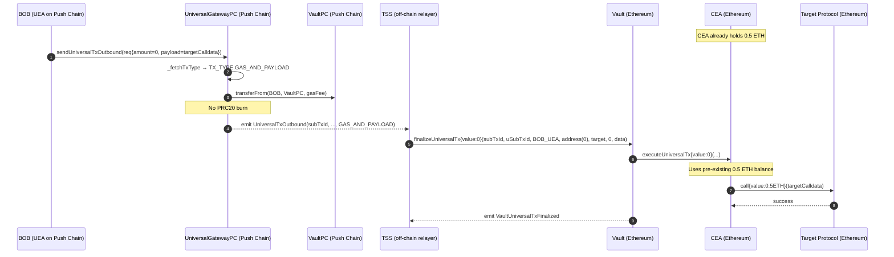

---

### 3.3 Execute with Native via CEA Balance + BURN (hybrid)

**Scenario**: BOB's CEA holds 0.3 ETH but the target requires 0.8 ETH. BOB burns
0.5 ETH worth of PRC20-ETH on Push Chain so Vault tops up the CEA, then both the
Vault-supplied and pre-existing balance are used.

**Push Chain call**: `amount=0.5 ether`, non-empty payload → `TX_TYPE.FUNDS_AND_PAYLOAD`

**TSS-crafted multicall payload**:
```solidity
Multicall[] memory calls = new Multicall[](1);
calls[0] = Multicall({
    to:    TARGET_CONTRACT,
    value: 0.8 ether,        // 0.5 from Vault + 0.3 from CEA pre-existing balance
    data:  targetCalldata
});
bytes memory data = abi.encode(calls);
```

**Key point**: Vault calls `executeUniversalTx{value: 0.5 ether}`. CEA's total ETH becomes
`0.3 + 0.5 = 0.8`. The multicall spends all 0.8 ETH. No strict `msg.value == sum(calls.value)` enforcement.

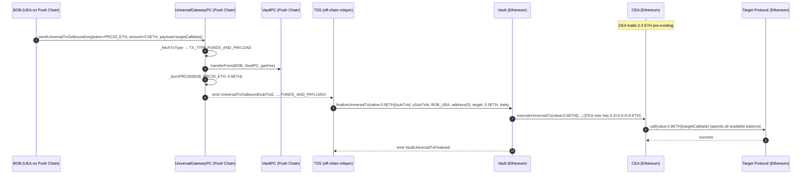

---

### 3.4 Execute with Token via BURN only

**Scenario**: BOB burns 500 USDC PRC20, gets 500 USDC in CEA, and deposits it into Aave.

**Push Chain call**: `token=PRC20_USDC, amount=500e6`, non-empty payload → `FUNDS_AND_PAYLOAD`

**Vault actions**:
1. `safeTransfer(CEA, 500e6)` — USDC sent to CEA
2. `executeUniversalTx(...)` — no value

**TSS-crafted multicall payload**:
```solidity
Multicall[] memory calls = new Multicall[](2);
// Approve Aave pool to spend USDC
calls[0] = Multicall({
    to:    USDC_ADDRESS,
    value: 0,
    data:  abi.encodeCall(IERC20.approve, (AAVE_POOL, 500e6))
});
// Deposit into Aave
calls[1] = Multicall({
    to:    AAVE_POOL,
    value: 0,
    data:  abi.encodeCall(IAavePool.supply, (USDC_ADDRESS, 500e6, address(CEA), 0))
});
bytes memory data = abi.encode(calls);
```

**Final state**:
- BOB's PRC20-USDC: reduced by `500e6 + gasFee`
- CEA: holds aUSDC (Aave receipt token)

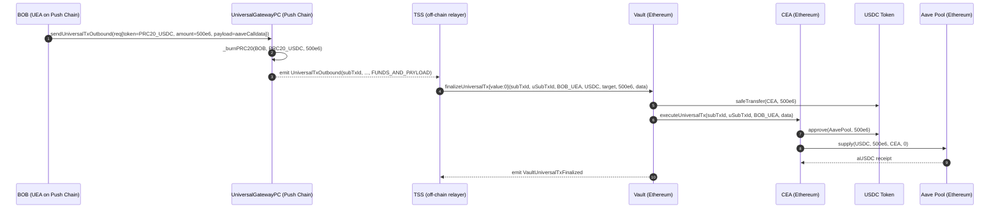

---

### 3.5 Execute with Token via CEA Balance only (no burn)

**Scenario**: CEA already holds 200 USDC. BOB instructs it to deposit into Aave without
burning any PRC20 on Push Chain.

**Push Chain call**: `amount=0`, non-empty payload → `TX_TYPE.GAS_AND_PAYLOAD`

**Vault actions**: `finalizeUniversalTx{value:0}` with `token=address(0), amount=0`

**TSS-crafted multicall payload**:
```solidity
// Same as 3.4 but CEA already holds the USDC — no Vault transfer needed
Multicall[] memory calls = new Multicall[](2);
calls[0] = Multicall({ to: USDC_ADDRESS, value: 0, data: abi.encodeCall(IERC20.approve, (AAVE_POOL, 200e6)) });
calls[1] = Multicall({ to: AAVE_POOL, value: 0, data: abi.encodeCall(IAavePool.supply, (USDC_ADDRESS, 200e6, address(CEA), 0)) });
bytes memory data = abi.encode(calls);
```

**Key difference from 3.4**: No USDC sent from Vault. CEA uses its own balance.

---

### 3.6 Execute with Token via CEA Balance + BURN (hybrid)

**Scenario**: CEA holds 100 USDC. BOB wants to supply 600 USDC to Aave.
He burns 500 PRC20-USDC on Push Chain; Vault sends 500 USDC to CEA.
CEA then has 600 USDC total and executes the Aave deposit.

**Push Chain call**: `token=PRC20_USDC, amount=500e6`, non-empty payload → `FUNDS_AND_PAYLOAD`

**Vault actions**:
1. `safeTransfer(CEA, 500e6)` — CEA now has `100e6 + 500e6 = 600e6` USDC
2. `executeUniversalTx(...)` — CEA executes approve + supply for 600 USDC

This works because CEA's `_handleMulticall` has no strict `sum(value) == msg.value` enforcement
for ERC20 tokens — it simply executes each call, which can draw on the full CEA balance.

---

## 4. Category 3 — CEA Self-Call Flows (sendUniversalTxFromCEA)

These flows occur when a CEA calls back into `UniversalGateway.sendUniversalTxFromCEA` to
initiate an inbound transaction from the external chain to Push Chain, on behalf of its UEA.

> **Anti-spoof invariant**: `req.recipient` must always equal `CEAFactory.getUEAForCEA(msg.sender)`.
> This is enforced in `UniversalGateway.sendUniversalTxFromCEA:359`.
> Without it, a malicious CEA could credit an arbitrary UEA.

> **fromCEA=true**: All events from this path emit `fromCEA=true` and `recipient=mappedUEA`.
> Push Chain uses this to credit the correct existing UEA rather than deploying a new one
> for the CEA's address.

The flows in this category are initiated by BOB on Push Chain via `sendUniversalTxOutbound`
with `amount=0` and a `payload` encoding the CEA multicall. TSS relays to Vault, which
triggers CEA execution, and the CEA's multicall calls `sendUniversalTxFromCEA`.

### 4.1 Overview and Anti-Spoof Invariant

```
BOB (Push Chain)
  → sendUniversalTxOutbound(amount=0, payload=multicallData)    [GAS_AND_PAYLOAD, no burn]
  → TSS observes UniversalTxOutbound event
  → Vault.finalizeUniversalTx(BOB_UEA, token=0, amount=0, data=multicallData)
  → CEA.executeUniversalTx(data=multicallData)
  → multicall: [..., sendUniversalTxFromCEA(req)]
  → UniversalGateway validates: isCEA(CEA), getUEAForCEA(CEA)==BOB_UEA, req.recipient==BOB_UEA
  → emits UniversalTx(fromCEA=true, recipient=BOB_UEA)
  → Push Chain credits BOB_UEA
```

---

### 4.2 FUNDS Native — via BURN

**Scenario**: BOB burns PRC20-ETH on Push Chain and sends it back to Push Chain via the CEA,
effectively moving ETH through the external chain and back.

This would rarely be used directly, but demonstrates the full cycle. More common in automated
strategy contracts that need to round-trip funds.

**Push Chain call (outbound)**: `amount>0`, non-empty payload → `FUNDS_AND_PAYLOAD`

The `payload` encodes a multicall that calls `sendUniversalTxFromCEA` with `TX_TYPE.FUNDS`
(native, no payload).

**Vault actions**: `finalizeUniversalTx{value: amount}(...)` — funds CEA with ETH, calls executeUniversalTx

**TSS-crafted multicall payload**:
```solidity
UniversalTxRequest memory req = UniversalTxRequest({
    recipient:       BOB_UEA,    // fromCEA: must be mappedUEA
    token:           address(0), // native
    amount:          ethAmount,
    payload:         bytes(""),
    revertRecipient: BOB_PUSH_ADDRESS,
    signatureData:   bytes("")
});

Multicall[] memory calls = new Multicall[](1);
calls[0] = Multicall({
    to:    UNIVERSAL_GATEWAY,
    value: ethAmount,
    data:  abi.encodeCall(IUniversalGateway.sendUniversalTxFromCEA, (req))
});
bytes memory data = abi.encode(calls);
```

**Gateway on external chain** (`sendUniversalTxFromCEA`):
1. Validates `isCEA(CEA_ADDR)` ✓
2. `getUEAForCEA(CEA_ADDR)` == `BOB_UEA` ✓
3. `req.recipient == BOB_UEA` ✓
4. Infers `TX_TYPE.FUNDS` (native, no payload)
5. `_consumeRateLimit(address(0), ethAmount)` — epoch rate limit applies
6. `_handleDeposits(address(0), ethAmount)` — ETH deposited into Vault
7. Emits `UniversalTx(sender=CEA, recipient=BOB_UEA, token=0, amount=ethAmount, fromCEA=true)`

**Push Chain result**: BOB's UEA receives PRC20-ETH (minted).

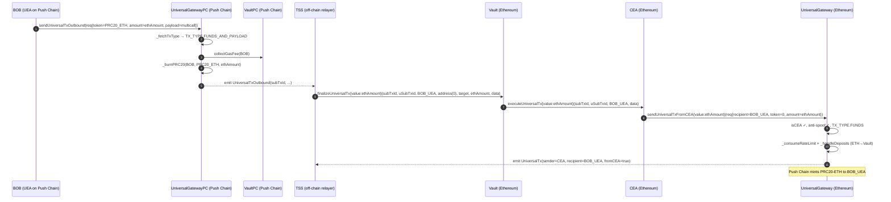

---

### 4.3 FUNDS Native — via CEA Balance + BURN

**Scenario**: CEA holds 0.2 ETH. BOB burns 0.3 PRC20-ETH. Together the CEA has 0.5 ETH
which it sends back to BOB's UEA via `sendUniversalTxFromCEA`.

The multicall calls `sendUniversalTxFromCEA{value: 0.5 ether}` — using 0.3 ETH from Vault
and 0.2 ETH from CEA's existing balance. No strict `msg.value == sum` enforcement allows this.

**Push Chain call**: `amount=0.3 ether`, non-empty payload → `FUNDS_AND_PAYLOAD`

**TSS-crafted multicall payload**:
```solidity
Multicall[] memory calls = new Multicall[](1);
calls[0] = Multicall({
    to:    UNIVERSAL_GATEWAY,
    value: 0.5 ether,            // 0.3 from Vault + 0.2 pre-existing in CEA
    data:  abi.encodeCall(IUniversalGateway.sendUniversalTxFromCEA, (UniversalTxRequest({
        recipient:       BOB_UEA,
        token:           address(0),
        amount:          0.5 ether,
        payload:         bytes(""),
        revertRecipient: BOB_PUSH_ADDRESS,
        signatureData:   bytes("")
    })))
});
```

---

### 4.4 FUNDS Token — via BURN

**Scenario**: BOB burns PRC20-USDC on Push Chain. Vault sends USDC to CEA. CEA approves
UniversalGateway and calls `sendUniversalTxFromCEA` to bridge USDC back to Push Chain.

**Push Chain call**: `token=PRC20_USDC, amount=500e6`, non-empty payload → `FUNDS_AND_PAYLOAD`

**TSS-crafted multicall payload**:
```solidity
Multicall[] memory calls = new Multicall[](2);
// Step 1: approve gateway to pull USDC
calls[0] = Multicall({
    to:    USDC_ADDRESS,
    value: 0,
    data:  abi.encodeCall(IERC20.approve, (UNIVERSAL_GATEWAY, 500e6))
});
// Step 2: call sendUniversalTxFromCEA — gateway safeTransferFrom(CEA → Vault)
calls[1] = Multicall({
    to:    UNIVERSAL_GATEWAY,
    value: 0,
    data:  abi.encodeCall(IUniversalGateway.sendUniversalTxFromCEA, (UniversalTxRequest({
        recipient:       BOB_UEA,
        token:           USDC_ADDRESS,
        amount:          500e6,
        payload:         bytes(""),
        revertRecipient: BOB_PUSH_ADDRESS,
        signatureData:   bytes("")
    })))
});
```

**Gateway infers**: `TX_TYPE.FUNDS` (token != 0, amount > 0, no payload, msg.value == 0)
**Epoch rate limit**: applies for USDC
**Push Chain result**: BOB's UEA receives 500 PRC20-USDC

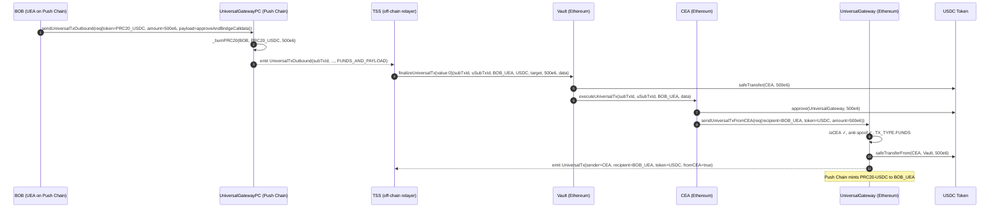

---

### 4.5 FUNDS Token — via CEA Balance + BURN

Same as 4.4 but CEA already holds some USDC. The multicall is crafted to approve and bridge
`existingBalance + burnAmount` by combining both balances.

---

### 4.6 FUNDS_AND_PAYLOAD Native — via BURN

**Scenario**: BOB bridges ETH back to Push Chain AND attaches a payload for the UEA to execute
on Push Chain (e.g., an on-chain vote or contract call on Push Chain).

**TSS-crafted multicall payload**:
```solidity
Multicall[] memory calls = new Multicall[](1);
calls[0] = Multicall({
    to:    UNIVERSAL_GATEWAY,
    value: ethAmount,
    data:  abi.encodeCall(IUniversalGateway.sendUniversalTxFromCEA, (UniversalTxRequest({
        recipient:       BOB_UEA,
        token:           address(0),
        amount:          ethAmount,
        payload:         pushChainPayload,   // non-empty = FUNDS_AND_PAYLOAD
        revertRecipient: BOB_PUSH_ADDRESS,
        signatureData:   bytes("")
    })))
});
```

**Gateway infers**: `TX_TYPE.FUNDS_AND_PAYLOAD` (native, amount>0, payload non-empty)
**Epoch rate limit**: applies
**Push Chain**: Credits BOB's UEA with ETH AND executes `pushChainPayload` via UEA

---

### 4.7 FUNDS_AND_PAYLOAD Native — via CEA Balance + BURN (with gas batching)

When `msg.value > req.amount` in `sendUniversalTxFromCEA`, the surplus becomes a gas top-up.
The gateway's `_sendTxWithFunds` (Case 2.2) splits: `gasAmount = nativeValue - req.amount`.

**TSS-crafted multicall payload**:
```solidity
// CEA sends: req.amount (bridged) + extra (gas top-up for UEA)
Multicall[] memory calls = new Multicall[](1);
calls[0] = Multicall({
    to:    UNIVERSAL_GATEWAY,
    value: req.amount + gasTopUpAmount,   // total value forwarded
    data:  abi.encodeCall(IUniversalGateway.sendUniversalTxFromCEA, (UniversalTxRequest({
        recipient:       BOB_UEA,
        token:           address(0),
        amount:          req.amount,       // only this much is "bridge amount"
        payload:         pushChainPayload,
        revertRecipient: BOB_PUSH_ADDRESS,
        signatureData:   bytes("")
    })))
});
```

**Gateway handles**:
- Gas leg: emits `UniversalTx(recipient=BOB_UEA, amount=gasTopUpAmount, txType=GAS, fromCEA=true)`
- Funds+payload leg: emits `UniversalTx(recipient=BOB_UEA, amount=req.amount, txType=FUNDS_AND_PAYLOAD, fromCEA=true)`

Both legs emit `fromCEA=true` and `recipient=BOB_UEA` so Push Chain routes correctly.

---

### 4.8 FUNDS_AND_PAYLOAD Token — via BURN

Same structure as 4.6 but with ERC20. The multicall must include an approve step before
calling `sendUniversalTxFromCEA`. The gateway pulls the token via `safeTransferFrom`.

**TSS-crafted multicall payload**:
```solidity
Multicall[] memory calls = new Multicall[](2);
calls[0] = Multicall({ to: TOKEN, value: 0, data: abi.encodeCall(IERC20.approve, (GATEWAY, amount)) });
calls[1] = Multicall({
    to:    UNIVERSAL_GATEWAY,
    value: 0,
    data:  abi.encodeCall(IUniversalGateway.sendUniversalTxFromCEA, (UniversalTxRequest({
        recipient:       BOB_UEA,
        token:           TOKEN,
        amount:          amount,
        payload:         pushChainPayload,
        revertRecipient: BOB_PUSH_ADDRESS,
        signatureData:   bytes("")
    })))
});
```

---

### 4.9 FUNDS_AND_PAYLOAD Token — via CEA Balance + BURN (with gas batching)

When the CEA call includes `msg.value > 0` alongside an ERC20 token (Case 2.3 in
`_sendTxWithFunds`), the native value becomes a gas top-up for the UEA.

**TSS-crafted multicall payload**:
```solidity
Multicall[] memory calls = new Multicall[](2);
calls[0] = Multicall({ to: TOKEN, value: 0, data: abi.encodeCall(IERC20.approve, (GATEWAY, tokenAmount)) });
calls[1] = Multicall({
    to:    UNIVERSAL_GATEWAY,
    value: gasTopUpAmount,    // native value → GAS leg
    data:  abi.encodeCall(IUniversalGateway.sendUniversalTxFromCEA, (UniversalTxRequest({
        recipient:       BOB_UEA,
        token:           TOKEN,
        amount:          tokenAmount,   // ERC20 bridged amount
        payload:         pushChainPayload,
        revertRecipient: BOB_PUSH_ADDRESS,
        signatureData:   bytes("")
    })))
});
```

**Gateway handles** (Case 2.3 in `_sendTxWithFunds`):
- Gas leg: `_sendTxWithGas(GAS, CEA, BOB_UEA, gasTopUpAmount, ...)` with `fromCEA=true`
- Funds+payload leg: standard FUNDS_AND_PAYLOAD for ERC20

---

### 4.10 GAS Top-Up from CEA (TX_TYPE.GAS)

**Scenario**: BOB's UEA on Push Chain is running low on gas. CEA has ETH. BOB initiates
a pure gas top-up: ETH flows from CEA → UniversalGateway → Vault (inbound) → UEA gas balance.

**Push Chain call**: `amount=0`, payload encodes a `sendUniversalTxFromCEA` with `token=0,
amount=ceaEthAmount, payload=""` → `TX_TYPE.GAS_AND_PAYLOAD` on Push Chain (outbound)

**CEA multicall**:
```solidity
Multicall[] memory calls = new Multicall[](1);
calls[0] = Multicall({
    to:    UNIVERSAL_GATEWAY,
    value: ceaEthAmount,
    data:  abi.encodeCall(IUniversalGateway.sendUniversalTxFromCEA, (UniversalTxRequest({
        recipient:       BOB_UEA,
        token:           address(0),
        amount:          ceaEthAmount,
        payload:         bytes(""),
        revertRecipient: BOB_PUSH_ADDRESS,
        signatureData:   bytes("")
    })))
});
```

**Gateway infers** (on external chain): `TX_TYPE.GAS` — `msg.value > 0`, `token=0`, `amount=ceaEthAmount`,
`payload=""`. USD cap check applies (instant route).

**Push Chain result**: BOB's UEA gas balance increases. No PRC20 minted.

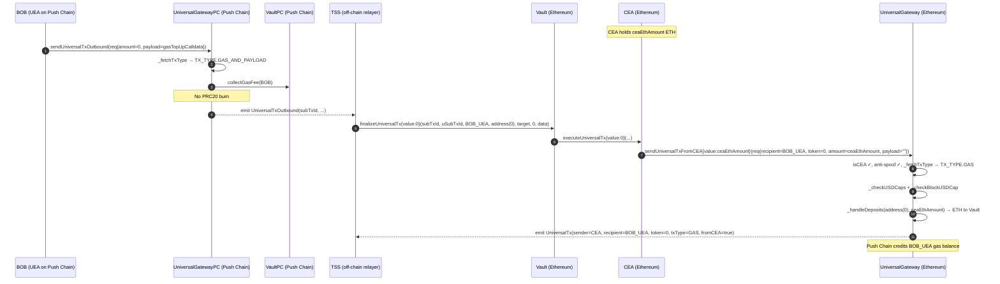

---

### 4.11 GAS_AND_PAYLOAD from CEA (payload only, UEA already has gas)

**Scenario**: BOB's UEA already has sufficient gas on Push Chain. BOB just needs to send
a payload for UEA execution — no gas top-up needed.

**CEA multicall**:
```solidity
Multicall[] memory calls = new Multicall[](1);
calls[0] = Multicall({
    to:    UNIVERSAL_GATEWAY,
    value: 0,              // no gas top-up
    data:  abi.encodeCall(IUniversalGateway.sendUniversalTxFromCEA, (UniversalTxRequest({
        recipient:       BOB_UEA,
        token:           address(0),
        amount:          0,
        payload:         pushChainPayload,  // non-empty
        revertRecipient: BOB_PUSH_ADDRESS,
        signatureData:   bytes("")
    })))
});
```

**Gateway infers** (on external chain): `TX_TYPE.GAS_AND_PAYLOAD` — `payload` non-empty, `msg.value=0`.
No USD cap check when `msg.value == 0` (instant route, no funds deposited).

**Push Chain result**: UEA executes `pushChainPayload`. No tokens transferred.

---

## 5. Category 4 — Revert Flows

Revert flows handle cases where a cross-chain transaction cannot be completed on Push Chain
(e.g., validation failure, user cancel, or execution error after TSS has already taken custody).
Funds are returned to the user on the source chain.

---

### 5.1 Revert ERC20 Token

**Scenario**: BOB submitted a USDC withdrawal but it was rejected on Push Chain. The Vault
holds the USDC. TSS calls `revertUniversalTxToken` to return it to `revertRecipient`.

**Call chain**:
```
TSS → Vault.revertUniversalTxToken(subTxId, uSubTxId, USDC, amount, revertInstruction)
    → Vault validates token support and balance
    → IERC20(USDC).safeTransfer(gateway, amount)
    → gateway.revertUniversalTxToken(subTxId, uSubTxId, USDC, amount, revertInstruction)
    → gateway transfers USDC to revertInstruction.revertRecipient
    → emit RevertUniversalTx
```

**Parameters** (`Vault.revertUniversalTxToken`, `Vault.sol:174-192`):
```solidity
struct RevertInstructions {
    address revertRecipient;  // where funds go on revert
    bytes revertMsg;          // arbitrary message for relayers/UEA
}
```

**Preconditions**:
- Vault holds ≥ `amount` USDC
- `revertInstruction.revertRecipient != address(0)`
- `gateway.isSupportedToken(USDC)` == true

**Error conditions**:
- `token == address(0)` → `ZeroAddress()`
- `amount == 0` → `InvalidAmount()`
- `IERC20(token).balanceOf(Vault) < amount` → `InvalidAmount()`
- Token not supported → `NotSupported()`

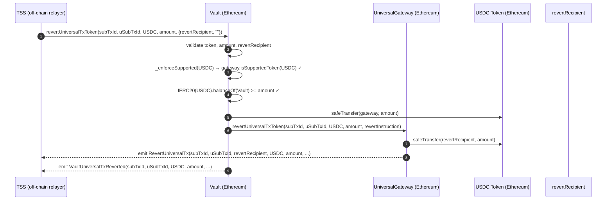

---

### 5.2 Revert Native Token

**Scenario**: BOB's native ETH withdrawal was rejected. The gateway holds ETH (ETH was
sent to the gateway as part of an inbound `sendUniversalTx` call). TSS calls
`revertUniversalTx` directly on `UniversalGateway` (no Vault involvement for native reverts).

**Call chain**:
```
TSS → UniversalGateway.revertUniversalTx(subTxId, uSubTxId, amount, revertInstruction)
    → gateway.call{value: amount}(revertRecipient)
    → emit RevertUniversalTx
```

**Note**: Native ETH revert bypasses Vault because ETH is held in the gateway directly
(deposited during inbound `sendUniversalTx`).

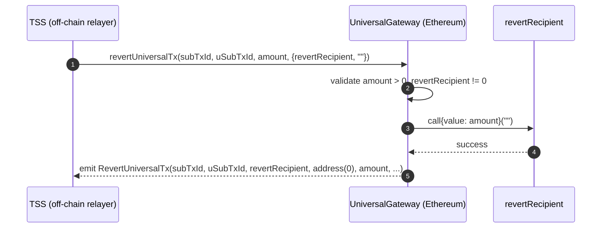

---

## 6. Null Execution (CEA Pre-funding)

### 6.1 What it is and when TSS uses it

A **null execution** is `Vault.finalizeUniversalTx` called with an **empty `data` payload**
(`bytes("")`). The CEA receives tokens or ETH but executes nothing.

**When TSS uses it**:
- Pre-fund a CEA before the user's actual execution request arrives
- Stage funds for a multi-step operation where execution happens in a later transaction
- Recover from a failed execution by re-funding without re-execution

**Call**:
```solidity
Vault.finalizeUniversalTx(
    subTxId,
    universalTxId,
    pushAccount,
    token,
    target,     // any non-zero address (backward compat)
    amount,
    bytes("")   // empty payload → CEA holds funds, no execution
);
```

**CEA behavior** with empty payload:
- `executeUniversalTx` is still called
- `data.length == 0` → `_handleExecution` receives empty bytes
- No multicall executed; CEA holds the funds silently

### 6.2 How funds are retrieved later

After pre-funding, BOB initiates a `GAS_AND_PAYLOAD` outbound from Push Chain.
TSS then calls `Vault.finalizeUniversalTx` with a non-empty multicall payload
that uses the pre-funded CEA balance (Section 3.2 or 3.5 pattern).

The CEA's `_handleMulticall` has no `msg.value == sum(value)` enforcement, so it can
spend the pre-funded balance freely as long as the calls are included in the multicall.

---

## Appendix

### A. Multicall Payload Encoding Reference

```solidity
// Encoding a multicall payload
Multicall[] memory calls = new Multicall[](n);
calls[0] = Multicall({ to: addr0, value: val0, data: calldata0 });
// ...
calls[n-1] = Multicall({ to: addrN, value: valN, data: calldataN });

bytes memory payload = abi.encode(calls);

// Decoding
Multicall[] memory decoded = abi.decode(payload, (Multicall[]));
```

**Constraints**:
- `calls[i].to != address(0)` — enforced in CEA
- Self-calls (`calls[i].to == address(CEA)`) must have `value == 0` — enforced in CEA
- Any call revert propagates upward and reverts the entire execution

### B. Event Reference

#### `UniversalTxOutbound` (UniversalGatewayPC — Push Chain)
```solidity
event UniversalTxOutbound(
    bytes32 indexed subTxId,
    address indexed sender,           // BOB's UEA address
    string  chainNamespace,           // e.g. "eip155:1" for Ethereum
    address token,                    // PRC20 token address
    bytes   target,                   // destination address (raw bytes)
    uint256 amount,                   // amount burned (0 for GAS_AND_PAYLOAD)
    address gasToken,                 // token used for gas fee
    uint256 gasFee,                   // gas fee collected
    uint256 gasLimitUsed,             // gas limit used for fee quote
    bytes   payload,                  // execution payload (empty for FUNDS)
    uint256 protocolFee,              // flat protocol fee component
    address revertRecipient,          // refund address on revert
    TX_TYPE txType                    // inferred transaction type
);
```

#### `UniversalTx` (UniversalGateway — External Chain)
```solidity
event UniversalTx(
    address indexed sender,           // source address (EOA or CEA)
    address indexed recipient,        // address(0) = sender's UEA; explicit = specific UEA (fromCEA)
    address token,                    // address(0) = native
    uint256 amount,
    bytes   payload,                  // empty for GAS/FUNDS; non-empty for *_AND_PAYLOAD
    address revertRecipient,
    TX_TYPE txType,
    bytes   signatureData,
    bool    fromCEA                   // true when called via sendUniversalTxFromCEA
);
```

#### `VaultUniversalTxFinalized` (Vault — External Chain)
```solidity
event VaultUniversalTxFinalized(
    bytes32 indexed subTxId,
    bytes32 indexed universalTxId,
    address indexed pushAccount,      // BOB's UEA
    address target,                   // backward-compat metadata, not used for routing
    address token,
    uint256 amount,
    bytes   data                      // multicall payload (abi.encode(Multicall[]))
);
```

#### `VaultUniversalTxReverted` (Vault — External Chain)
```solidity
event VaultUniversalTxReverted(
    bytes32 indexed subTxId,
    bytes32 indexed universalTxId,
    address indexed token,
    uint256 amount,
    RevertInstructions revertInstruction
);
```

---

### C. TX_TYPE Decision Matrix (Both Chains)

#### Push Chain Outbound (`UniversalGatewayPC._fetchTxType`)

| `req.payload.length` | `req.amount` | TX_TYPE             | Burns PRC20 | Route (Push Chain) |
| -------------------- | ------------ | ------------------- | ----------- | ------------------ |
| 0                    | > 0          | `FUNDS`             | yes         | High-confirmation  |
| > 0                  | > 0          | `FUNDS_AND_PAYLOAD` | yes         | High-confirmation  |
| > 0                  | 0            | `GAS_AND_PAYLOAD`   | no          | N/A (no route)     |
| 0                    | 0            | ❌ `InvalidInput()`  | —           | —                  |

#### External Chain Inbound (`UniversalGateway._fetchTxType`, normal path)

| `req.payload.length` | `req.token` | `req.amount` | `msg.value`    | TX_TYPE             | Rate Limit                       |
| -------------------- | ----------- | ------------ | -------------- | ------------------- | -------------------------------- |
| 0                    | 0 (native)  | 0            | > 0            | `GAS`               | USD block cap                    |
| > 0                  | any         | 0            | any            | `GAS_AND_PAYLOAD`   | USD block cap (if msg.value > 0) |
| 0                    | any         | > 0          | == amount or 0 | `FUNDS`             | Epoch per-token                  |
| > 0                  | any         | > 0          | any            | `FUNDS_AND_PAYLOAD` | Epoch per-token                  |

---

### D. Security Invariants

| Invariant                     | Enforced in                          | Description                                               |
| ----------------------------- | ------------------------------------ | --------------------------------------------------------- |
| Only TSS can execute          | `Vault.sol:159` `onlyRole(TSS_ROLE)` | No one else can call `finalizeUniversalTx`                |
| Anti-spoof (CEA path)         | `UniversalGateway.sol:359`           | `req.recipient` must equal `getUEAForCEA(CEA)`            |
| No CEA on normal path         | `UniversalGateway.sol`               | `sendUniversalTx` blocks CEA callers (`InvalidInput`)     |
| Token/value invariant         | `Vault.sol:207-214`                  | Native: `msg.value == amount`; ERC20: `msg.value == 0`    |
| Token support                 | `Vault.sol:199`                      | All tokens validated via `gateway.isSupportedToken()`     |
| Reentrancy protection         | `nonReentrant` on all entry points   | Prevents re-entrant execution                             |
| Pausable                      | `whenNotPaused` on all entry points  | Emergency halt for Vault, Gateway, GatewayPC              |
| Self-call value block         | `CEA_temp.sol:197`                   | CEA self-calls with `value != 0` are rejected             |
| subTxId replay guard          | `CEA._isExecuted`                    | Each `subTxId` can only execute once                      |
| `target` not used for routing | `Vault.sol:150` NatSpec              | `target` is metadata only; multicall payload routes funds |
