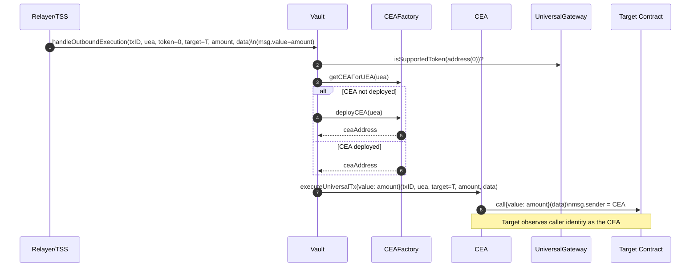
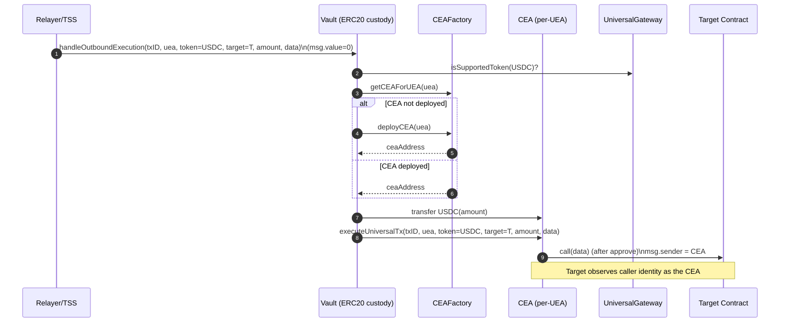
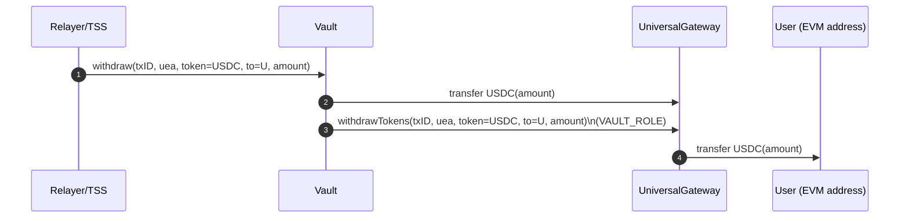
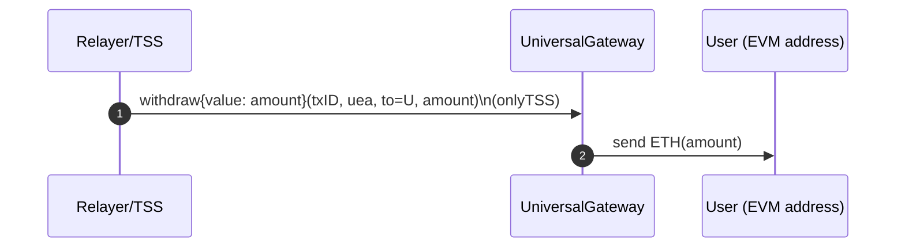
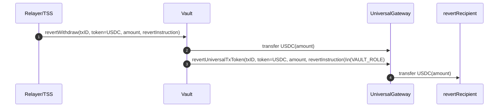
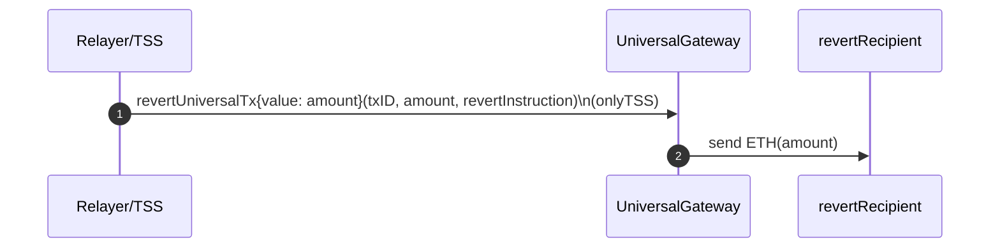

# Outbound Flows with CEA and VAULT

As per current architecture, there are 6 possible outbound flows:

1. **WithdrawToken: Native**
2. **WithdrawToken: Non-Native**
3. **RevertUniversalTx: Native**
4. **RevertUniversalTx: Non-Native**
5. **ExecuteUniversalTx: Native Token with Payload**
6. **ExecuteUniversalTx: Non-Native Token with Payload**

Now, with CEAs and Vault in the mix, mentioned below is the current flow for each of these cases

---

As per current architecture, there are 6 possible outbound flows:

1. **WithdrawToken: Native**
2. **WithdrawToken: Non-Native**
3. **RevertUniversalTx: Native**
4. **RevertUniversalTx: Non-Native**
5. **ExecuteUniversalTx: Native Token with Payload**
6. **ExecuteUniversalTx: Non-Native Token with Payload**

Now, with CEAs and Vault in the mix, mentioned below is the current flow for each of these cases.

---

### Case1: **ExecuteUniversalTx**

- For any execution of universal transactions, the relayer must call VAULT contract itself.
- Once Vault and CEA are introduced, UniversalGateway no longer has executeUniversalTx() functions ( CEA has it ).

**Case1.1: ExecuteUniversalTx: Native Token with Payload**

1. Relayer/TSS calls Vault.handleOutboundExecution{value: amount}(... )
    - token = address(0),  amount = 100 ETH,  msg.value MUST equal amount
2. Vault:
    - gets/deploys CEA
    - calls **`CEA.executeUniversalTx{value: amount}(txID, uea, target, amount, data)`**
3. CEA:
    - calls target.call{value: amount}(payload)

### **Token flow**

- ETH is **not stored by TSS itself.**
- **When executeUniversalTx for native is to be called, TSS passes msg.value required for execution.**

**Case 1.2: ExecuteUniversalTx: Non-Native Token with Payload**

### **Control flow**

1. **Relayer/TSS calls Vault.handleOutboundExecution(...)**
2. Vault:
    - gets CEA for UEA via CEAFactory.getCEAForUEA(), deploys if missing
    - **transfers USDC from Vault → CEA**
    - calls **`CEA.executeUniversalTx(txID, uea, token, target, amount, data)`**
3. CEA:
    - performs validations and executes

### **Token flow**

- Non-Native tokens is custodied in **Vault** until outbound.
- On outbound execution, Vault **pushes USDC into CEA**, then CEA executes.
- The **target contract sees msg.sender == CEA**, not Vault/Gateway.

    

---

### Case 2: Withdraw Tokens

- For simple token withdrawals, currently both VAULT and Gateway shares the responsibility.
- **For non-native tokens, flow is TSS/RELAYER → Vault → Gateway → User**
- **For native tokens, flow is TSS/RELAYER → Gateway → User**

**Case 2.1: withdrawTokens non-native** 

1. **Relayer/TSS calls Vault.withdraw(txID, uea, token, to, amount)**
2. Vault.withdraw():
    - **transfers token from Vault → UniversalGateway**
    - calls **gateway.withdrawTokens(txID, uea, token, to, amount)**
3. UniversalGateway.withdrawTokens():
    - checks VAULT_ROLE
    - marks tx executed
    - transfers token from gateway → to

    

**Case 2.2: withdrawTokens native**

> *Native withdrawal **does not go through Vault** (in your current contracts). It’s gateway-only and TSS-only.*
> 
1. **Relayer/TSS calls UniversalGateway.withdraw{value: amount}(txID, uea, to, amount)**
2. UniversalGateway.withdraw():
    - requires onlyTSS
    - marks tx executed
    - sends ETH to user

**Token flow**

- ETH comes from the TSS-funded call into gateway, then gateway forwards to user.

    

---

### Case 3: **RevertUniversalTx: Non-Native**

- similar to withdraw, both VAULT and Gateway shares the responsibility.
- **For non-native tokens revert, flow is TSS/RELAYER → Vault → Gateway → revertRecipient**
- **For native tokens, flow is TSS/RELAYER → Gateway ( msg.value ) → revertRecipient**

**Case 3.1: revertUniversalTx non-native**

1. **Relayer/TSS calls `Vault.revertWithdraw(txID, token, amount, revertInstruction)`**
2. Vault.revertWithdraw():
    - **transfers token Vault → Gateway**
    - calls **gateway.revertUniversalTxToken(txID, token, amount, revertInstruction)**
3. UniversalGateway.revertUniversalTxToken():
    - onlyRole(VAULT_ROLE)
    - transfers token to revertInstruction.revertRecipient

    

**Case 3.2: revertUniversalTx native**

1. **Relayer/TSS calls `UniversalGateway.revertUniversalTx{value: amount}(txID, amount, revertInstruction)`**
2. UniversalGateway.revertUniversalTx():
    - onlyTSS
    - marks tx executed
    - sends ETH to revertInstruction.revertRecipient

