# Outbound Transaction Flows v2

This document describes all valid outbound transaction flows in the CEA-mediated architecture.
"Outbound" means: a user on Push Chain initiates a transaction that results in execution on an
external EVM chain (Ethereum, Base, Arbitrum, etc.).

---

## 1. Architecture Overview

### 1.1 Chain Roles and Contract Placement

| Chain          | Contract             | Role                                                                |
| -------------- | -------------------- | ------------------------------------------------------------------- |
| Push Chain     | `UniversalGatewayPC` | Outbound entry point; infers TX_TYPE; burns PRC20; collects fees    |
| Push Chain     | `VaultPC`            | Receives gas fees from outbound requests                            |
| External Chain | `Vault`              | TSS-controlled custody; deploys/funds CEA; calls executeUniversalTx |
| External Chain | `CEAFactory`         | Deterministic CREATE2 deployer for CEA contracts                    |
| External Chain | `CEA`                | Per-UEA smart contract wallet; executes multicall payloads          |
| External Chain | `UniversalGateway`   | Inbound entry point; handles CEA→UEA self-calls; processes reverts  |

### 1.2 Actors

| Actor   | Description                                                                                                                                                  |
| ------- | ------------------------------------------------------------------------------------------------------------------------------------------------------------ |
| **BOB** | The end user. Has a UEA (Universal Execution Account) on Push Chain and an associated CEA on the external chain.                                             |
| **UEA** | BOB's account on Push Chain — the address from which he calls `sendUniversalTxOutbound`.                                                                     |
| **TSS** | Off-chain Threshold Signature Scheme relayer operated by Push Chain validators. Observes `UniversalTxOutbound` events and calls `Vault.finalizeUniversalTx`. |
| **CEA** | BOB's Chain Execution Account on the external chain. Deterministically derived from BOB's UEA address. Holds tokens and executes multicalls on BOB's behalf. |

### 1.3 Token Model: PRC20 Burn/Mint Mechanics

PRC20 tokens are wrapped representations of external chain tokens on Push Chain.

- **Outbound withdrawal**: When `amount > 0`, `UniversalGatewayPC` burns PRC20 tokens from BOB. The corresponding tokens are released from `Vault` on the external chain.
- **Gas fee**: Always collected in PRC20 (or designated gas token) via `_moveFees → VaultPC`, regardless of whether `amount > 0`.

### 1.4 TX_TYPE Reference

#### Push Chain (`UniversalGatewayPC._fetchTxType`, `src/UniversalGatewayPC.sol:139-160`)

| `req.payload` | `req.amount` | TX_TYPE             | PRC20 Burn | Description                                |
| ------------- | ------------ | ------------------- | ---------- | ------------------------------------------ |
| empty         | > 0          | `FUNDS`             | yes        | Pure withdrawal — deliver tokens to target |
| non-empty     | > 0          | `FUNDS_AND_PAYLOAD` | yes        | Withdraw + execute on external chain       |
| non-empty     | == 0         | `GAS_AND_PAYLOAD`   | no         | Execute using pre-existing CEA balance     |
| empty         | == 0         | ❌ reverts           | —          | Empty transaction, rejected                |

#### External Chain (`UniversalGateway._fetchTxType`, used for CEA→UEA self-calls)

Only `FUNDS` and `FUNDS_AND_PAYLOAD` are currently active for CEA→UEA routes.
`GAS` and `GAS_AND_PAYLOAD` via CEA are not enabled.

| `req.amount`           | `req.payload` | TX_TYPE                        | Route    |
| ---------------------- | ------------- | ------------------------------ | -------- |
| == 0, native value > 0 | empty         | `GAS` *(inactive)*             | Instant  |
| == 0                   | non-empty     | `GAS_AND_PAYLOAD` *(inactive)* | Instant  |
| > 0                    | empty         | `FUNDS`                        | Standard |
| > 0                    | non-empty     | `FUNDS_AND_PAYLOAD`            | Standard |

### 1.5 Multicall Payload: The CEA Execution Engine

All CEA operations route through a `Multicall[]` payload:

```solidity
struct Multicall {
    address to;      // Target contract address
    uint256 value;   // Native token amount to forward with this call
    bytes data;      // ABI-encoded call data
}

// Encoding:
bytes memory payload = abi.encode(multicallArray);
```

Key rules (`CEA.sol:182-207`):
- Calls execute sequentially; any revert fails the whole batch.
- No strict `sum(call.value) == msg.value` — CEA may spend pre-existing balance alongside Vault-supplied value (enables hybrid flows).
- Self-calls to CEA must have `value == 0`.
- **Empty payload**: CEA receives funds and holds them — nothing executed.

### 1.6 Funding Sources: BURN vs CEA Balance vs Hybrid

Users can either use 3 main routes for any outbound executions (Push Chain to Source Chain):
1. **BURN only**: Burn PRC20 on Push Chain → Vault releases tokens to CEA → CEA executes.
2. **CEA balance**: No burn; CEA uses tokens it already holds. Push Chain call uses `amount=0`.
3. **Hybrid**: Both — Vault-supplied tokens combine with CEA's pre-existing balance for execution.

---

## 2. Category 1 — Withdrawal Flows

Withdrawal flows come in two distinct kinds depending on where the tokens land:

- **Source-Chain Withdrawal**: tokens are delivered to an address on the external chain (EOA, contract, or any recipient). Push Chain burns PRC20 → Vault releases tokens → CEA transfers them to `recipientAddress`. The tokens never return to Push Chain.

- **UEA Withdrawal**: tokens held in the CEA on the external chain are moved back to BOB's UEA on Push Chain. The CEA calls `sendUniversalTxFromCEA`, which bridges the funds back as inbound PRC20. No tokens were necessarily burned on Push Chain first.

> **Note on `target`**: `Vault.finalizeUniversalTx`'s `target` parameter is backward-compat
> metadata only — it does not control routing. The multicall payload determines where funds go.

---

### 2.1 Source-Chain Native Withdrawal (WITH BURN)

**Scenario**: BOB burns PRC20-ETH on Push Chain and withdraws 1 ETH to `recipientAddress`
on Ethereum. The ETH lands on the source chain — it does not return to Push Chain.

**Push Chain call**:
```solidity
UniversalOutboundTxRequest({
    target:          abi.encode(recipientAddress),
    token:           PRC20_ETH,
    amount:          1 ether,
    gasLimit:        0,
    payload:         bytes(""),       // empty → FUNDS
    revertRecipient: BOB_PUSH_ADDRESS
})
```

**TX_TYPE**: `FUNDS`. Gateway collects gas fee, burns 1 PRC20-ETH, emits `UniversalTxOutbound`.

**TSS** observes the event and calls `Vault.finalizeUniversalTx{value: 1 ETH}`. Vault gets/deploys
BOB's CEA, forwards 1 ETH to it, and calls `CEA.executeUniversalTx`.

**Multicall payload** (TSS-crafted):
```solidity
Multicall[] memory calls = new Multicall[](1);
calls[0] = Multicall({ to: recipientAddress, value: 1 ether, data: bytes("") });
bytes memory data = abi.encode(calls);
```

**Result**: `recipientAddress` on Ethereum receives 1 ETH. BOB's PRC20-ETH reduced by `amount + gasFee`.

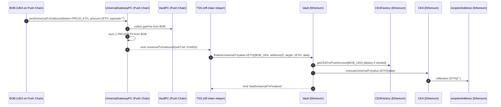

---

### 2.2 Source-Chain Token Withdrawal (WITH BURN)

**Scenario**: BOB burns PRC20-USDC on Push Chain and withdraws 1000 USDC to `recipientAddress`
on Ethereum. The USDC lands on the source chain — it does not return to Push Chain.

**Push Chain call**: `token=PRC20_USDC, amount=1000e6, payload=""` → `TX_TYPE.FUNDS`.

**Vault actions**: Transfers 1000e6 USDC to CEA (`safeTransfer`), then calls `CEA.executeUniversalTx`.

**Multicall payload** (TSS-crafted):
```solidity
Multicall[] memory calls = new Multicall[](1);
calls[0] = Multicall({
    to:    USDC_ADDRESS,
    value: 0,
    data:  abi.encodeCall(IERC20.transfer, (recipientAddress, 1000e6))
});
bytes memory data = abi.encode(calls);
```

**Result**: `recipientAddress` on Ethereum receives 1000 USDC.

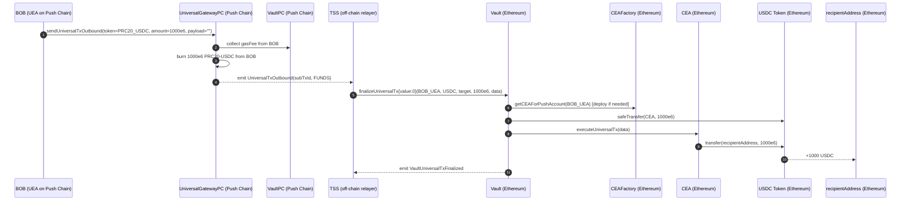

---

### 2.3 UEA Withdrawal — Native ETH from CEA back to UEA (no burn, FUNDS)

**Scenario**: BOB's CEA already holds ETH from a prior operation. BOB wants that ETH back
as PRC20-ETH on his UEA on Push Chain — without burning any additional PRC20.

The CEA calls `sendUniversalTxFromCEA` from within its multicall, which bridges the ETH
back inbound. This is a **FUNDS** transaction on the external chain (`amount > 0`, no payload).

**Push Chain call**: `amount=0`, `payload=<multicallCalldata>` → `TX_TYPE.GAS_AND_PAYLOAD`. No burn.

> `amount=0` on Push Chain (no PRC20 burned). The actual funds being bridged back are the
> CEA's pre-existing ETH balance — they move inbound via `sendUniversalTxFromCEA`.

**Multicall payload** (TSS-crafted):
```solidity
Multicall[] memory calls = new Multicall[](1);
calls[0] = Multicall({
    to:    UNIVERSAL_GATEWAY,
    value: ceaEthAmount,          // CEA spends its own ETH balance
    data:  abi.encodeCall(IUniversalGateway.sendUniversalTxFromCEA, (UniversalTxRequest({
        recipient:       BOB_UEA,   // fromCEA: must equal getUEAForCEA(CEA)
        token:           address(0),
        amount:          ceaEthAmount,
        payload:         bytes(""),
        revertRecipient: BOB_PUSH_ADDRESS,
        signatureData:   bytes("")
    })))
});
bytes memory data = abi.encode(calls);
```

**CEA execution**: Calls `sendUniversalTxFromCEA{value: ceaEthAmount}`. Gateway validates CEA
identity and anti-spoof (`req.recipient == mappedUEA`), infers `TX_TYPE.FUNDS` (native,
no payload), deposits ETH into Vault, emits `UniversalTx(fromCEA=true, recipient=BOB_UEA)`.

**Result**: BOB's UEA on Push Chain receives PRC20-ETH (minted). No PRC20 burned.

> **fromCEA semantics**: `recipient=BOB_UEA` and `fromCEA=true` are required so Push Chain
> credits BOB's actual UEA rather than deploying a new UEA for the CEA's address.

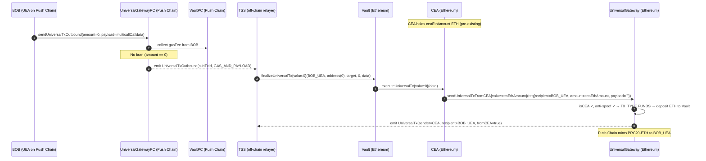

---

### 2.4 UEA Withdrawal — USDC from CEA back to UEA (no burn, FUNDS)

**Scenario**: BOB's CEA holds USDC from a prior operation. BOB retrieves it back to his UEA
on Push Chain as PRC20-USDC — without burning any PRC20 on Push Chain first.

The CEA approves the gateway, then calls `sendUniversalTxFromCEA` so the gateway pulls USDC
from the CEA and bridges it back inbound as a **FUNDS** transaction (ERC20, no payload).

**Push Chain call**: `amount=0`, `payload=<multicallCalldata>` → `TX_TYPE.GAS_AND_PAYLOAD`. No burn.

**Multicall payload** (TSS-crafted):
```solidity
// Step 1: CEA approves gateway to pull USDC via safeTransferFrom
// Step 2: CEA calls sendUniversalTxFromCEA — gateway pulls USDC into Vault
Multicall[] memory calls = new Multicall[](2);
calls[0] = Multicall({
    to:    USDC_ADDRESS,
    value: 0,
    data:  abi.encodeCall(IERC20.approve, (UNIVERSAL_GATEWAY, ceaUsdcAmount))
});
calls[1] = Multicall({
    to:    UNIVERSAL_GATEWAY,
    value: 0,
    data:  abi.encodeCall(IUniversalGateway.sendUniversalTxFromCEA, (UniversalTxRequest({
        recipient:       BOB_UEA,
        token:           USDC_ADDRESS,
        amount:          ceaUsdcAmount,
        payload:         bytes(""),
        revertRecipient: BOB_PUSH_ADDRESS,
        signatureData:   bytes("")
    })))
});
bytes memory data = abi.encode(calls);
```

> For ERC20, the CEA must approve the gateway before calling `sendUniversalTxFromCEA`.
> The gateway's `_handleDeposits` pulls USDC via `safeTransferFrom(CEA, Vault, amount)`.

**Result**: Gateway infers `TX_TYPE.FUNDS`, pulls USDC from CEA, emits
`UniversalTx(fromCEA=true, recipient=BOB_UEA)`. Push Chain mints PRC20-USDC to BOB's UEA.

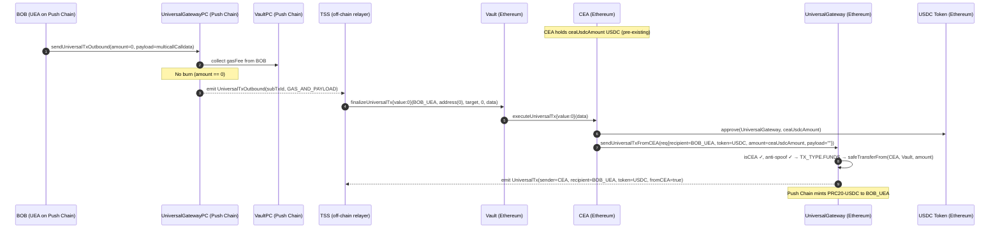

---

### 2.5 UEA Withdrawal — Native ETH from CEA to UEA WITH payload (FUNDS_AND_PAYLOAD)

**Scenario**: BOB's CEA holds ETH. BOB retrieves it to his UEA on Push Chain **and** attaches
a payload for the UEA to execute on Push Chain (e.g., stake the received ETH into a Push Chain
protocol). This is a `FUNDS_AND_PAYLOAD` transaction on the external chain.

**Push Chain call**: `amount=0`, `payload=<multicallCalldata>` → `TX_TYPE.GAS_AND_PAYLOAD`. No burn.

**Multicall payload** (TSS-crafted):
```solidity
Multicall[] memory calls = new Multicall[](1);
calls[0] = Multicall({
    to:    UNIVERSAL_GATEWAY,
    value: ceaEthAmount,
    data:  abi.encodeCall(IUniversalGateway.sendUniversalTxFromCEA, (UniversalTxRequest({
        recipient:       BOB_UEA,
        token:           address(0),
        amount:          ceaEthAmount,
        payload:         pushChainPayload,   // non-empty → FUNDS_AND_PAYLOAD
        revertRecipient: BOB_PUSH_ADDRESS,
        signatureData:   bytes("")
    })))
});
bytes memory data = abi.encode(calls);
```

**Gateway infers**: `TX_TYPE.FUNDS_AND_PAYLOAD` (native, `amount > 0`, `payload` non-empty).
Epoch rate limit applies. Push Chain credits BOB's UEA with PRC20-ETH **and** executes
`pushChainPayload` via the UEA.

---

### 2.6 UEA Withdrawal — USDC from CEA to UEA WITH payload (FUNDS_AND_PAYLOAD)

**Scenario**: BOB's CEA holds USDC. BOB retrieves it to his UEA on Push Chain **and** attaches
a payload for the UEA to execute on Push Chain.

**Push Chain call**: `amount=0`, non-empty payload → `TX_TYPE.GAS_AND_PAYLOAD`. No burn.

**Multicall payload** (TSS-crafted):
```solidity
Multicall[] memory calls = new Multicall[](2);
// Step 1: approve gateway
calls[0] = Multicall({
    to:    USDC_ADDRESS,
    value: 0,
    data:  abi.encodeCall(IERC20.approve, (UNIVERSAL_GATEWAY, ceaUsdcAmount))
});
// Step 2: bridge USDC + carry Push Chain payload
calls[1] = Multicall({
    to:    UNIVERSAL_GATEWAY,
    value: 0,
    data:  abi.encodeCall(IUniversalGateway.sendUniversalTxFromCEA, (UniversalTxRequest({
        recipient:       BOB_UEA,
        token:           USDC_ADDRESS,
        amount:          ceaUsdcAmount,
        payload:         pushChainPayload,   // non-empty → FUNDS_AND_PAYLOAD
        revertRecipient: BOB_PUSH_ADDRESS,
        signatureData:   bytes("")
    })))
});
bytes memory data = abi.encode(calls);
```

**Gateway infers**: `TX_TYPE.FUNDS_AND_PAYLOAD` (ERC20, `amount > 0`, `payload` non-empty).
Push Chain credits BOB's UEA with PRC20-USDC **and** executes `pushChainPayload` via the UEA.

---

## 3. Category 2 — DeFi / Arbitrary Execution Flows

These flows execute arbitrary contract calls on the external chain using CEA as the execution
context. The multicall payload encodes the protocol interactions.

---

### 3.1 Execute with Native via BURN only

**Scenario**: BOB burns 1 PRC20-ETH and executes a Uniswap swap on Ethereum with those funds.

**Push Chain call**: `token=PRC20_ETH, amount=1 ether, payload=<swapCalldata>` → `FUNDS_AND_PAYLOAD`.

**Vault** sends 1 ETH to CEA via `executeUniversalTx{value: 1 ether}`.

**Multicall payload** (TSS-crafted):
```solidity
Multicall[] memory calls = new Multicall[](1);
calls[0] = Multicall({
    to:    UNISWAP_ROUTER,
    value: 1 ether,
    data:  abi.encodeCall(IUniswapRouter.exactInputSingle, (swapParams))
});
bytes memory data = abi.encode(calls);
```

**Result**: Swap output tokens arrive in CEA. BOB's PRC20-ETH reduced by `1 ether + gasFee`.

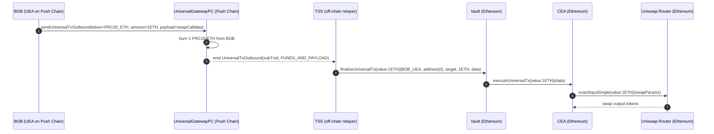

---

### 3.2 Execute with Native via CEA Balance only (no burn)

**Scenario**: BOB's CEA already holds 0.5 ETH. BOB instructs it to call a contract on Ethereum
without burning any PRC20 on Push Chain.

**Push Chain call**: `amount=0`, `payload=<targetCalldata>` → `TX_TYPE.GAS_AND_PAYLOAD`. No burn.

**Vault** calls `CEA.executeUniversalTx{value: 0}` — no ETH forwarded.

**Multicall payload** (TSS-crafted):
```solidity
Multicall[] memory calls = new Multicall[](1);
calls[0] = Multicall({ to: TARGET_CONTRACT, value: 0.5 ether, data: targetCalldata });
// CEA spends its own pre-existing 0.5 ETH balance
bytes memory data = abi.encode(calls);
```

**Result**: CEA ETH balance reduced by 0.5. No PRC20 burned.

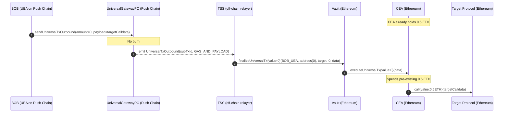

---

### 3.3 Execute with Native via CEA Balance + BURN (hybrid)

**Scenario**: CEA holds 0.3 ETH but the target requires 0.8 ETH. BOB burns 0.5 PRC20-ETH;
Vault tops up the CEA. The multicall spends the combined 0.8 ETH.

**Push Chain call**: `amount=0.5 ether, payload=<targetCalldata>` → `FUNDS_AND_PAYLOAD`.

**Vault** calls `CEA.executeUniversalTx{value: 0.5 ether}`. CEA now holds `0.3 + 0.5 = 0.8 ETH`.

**Multicall payload** (TSS-crafted):
```solidity
Multicall[] memory calls = new Multicall[](1);
calls[0] = Multicall({ to: TARGET_CONTRACT, value: 0.8 ether, data: targetCalldata });
// Draws on 0.5 ETH from Vault + 0.3 ETH pre-existing in CEA
bytes memory data = abi.encode(calls);
```

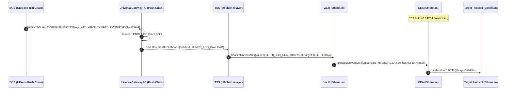

---

### 3.4 Execute with Token via BURN only

**Scenario**: BOB burns 500 PRC20-USDC and deposits it into Aave via CEA.

**Push Chain call**: `token=PRC20_USDC, amount=500e6, payload=<aaveCalldata>` → `FUNDS_AND_PAYLOAD`.

**Vault** sends 500e6 USDC to CEA (`safeTransfer`), then calls `CEA.executeUniversalTx`.

**Multicall payload** (TSS-crafted):
```solidity
Multicall[] memory calls = new Multicall[](2);
calls[0] = Multicall({ to: USDC_ADDRESS, value: 0, data: abi.encodeCall(IERC20.approve, (AAVE_POOL, 500e6)) });
calls[1] = Multicall({ to: AAVE_POOL, value: 0, data: abi.encodeCall(IAavePool.supply, (USDC_ADDRESS, 500e6, address(CEA), 0)) });
bytes memory data = abi.encode(calls);
```

**Result**: CEA holds aUSDC receipt tokens. BOB's PRC20-USDC reduced by `500e6 + gasFee`.

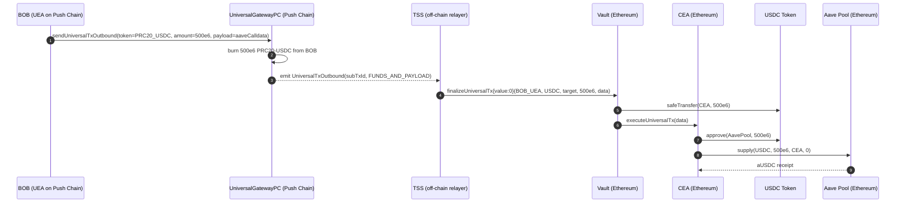

---

### 3.5 Execute with Token via CEA Balance only (no burn)

**Scenario**: CEA already holds 200 USDC. BOB instructs it to deposit into Aave without
burning any PRC20.

**Push Chain call**: `amount=0`, `payload=<aaveCalldata>` → `TX_TYPE.GAS_AND_PAYLOAD`. No burn.

**Vault** calls `CEA.executeUniversalTx{value: 0}` with no token transfer — CEA uses its own balance.

**Multicall payload** (same structure as 3.4, but CEA already holds the USDC):
```solidity
Multicall[] memory calls = new Multicall[](2);
calls[0] = Multicall({ to: USDC_ADDRESS, value: 0, data: abi.encodeCall(IERC20.approve, (AAVE_POOL, 200e6)) });
calls[1] = Multicall({ to: AAVE_POOL, value: 0, data: abi.encodeCall(IAavePool.supply, (USDC_ADDRESS, 200e6, address(CEA), 0)) });
bytes memory data = abi.encode(calls);
```

---

### 3.6 Execute with Token via CEA Balance + BURN (hybrid)

**Scenario**: CEA holds 100 USDC. BOB wants to supply 600 USDC to Aave. He burns 500 PRC20-USDC;
Vault sends 500 USDC to CEA. CEA now has 600 USDC and executes the Aave deposit.

**Push Chain call**: `token=PRC20_USDC, amount=500e6, payload=<aaveCalldata>` → `FUNDS_AND_PAYLOAD`.

**Vault** sends 500e6 USDC to CEA (`safeTransfer`). CEA balance becomes `100e6 + 500e6 = 600e6`.
The multicall executes approve + supply for the full 600e6, drawing on both Vault-supplied and
pre-existing balance.

---

## 4. Category 3 — CEA Self-Call Flows with BURN (sendUniversalTxFromCEA + PRC20 burn)

These flows combine a PRC20 burn on Push Chain **with** a CEA self-call that immediately
bridges the released tokens back to the UEA. The distinguishing feature versus Category 1
UEA Withdrawals (sections 2.3–2.6) is that here PRC20 **is** burned first — Vault supplies
fresh tokens to the CEA, and the CEA's multicall then calls `sendUniversalTxFromCEA` to
bridge them inbound in the same atomic execution.

Use cases: round-trip token flows in automated strategies, bridging while simultaneously
sending a Push Chain payload, and gas-batched bridging.

Only `FUNDS` and `FUNDS_AND_PAYLOAD` are currently active for CEA→UEA routes.

> **Anti-spoof invariant** (`UniversalGateway.sol:359`): `req.recipient` must equal
> `CEAFactory.getUEAForCEA(msg.sender)`. The gateway enforces this unconditionally.
> Without it, a CEA could credit an arbitrary UEA.

> **fromCEA flag**: All events on this path emit `fromCEA=true` and `recipient=mappedUEA`.
> Push Chain uses this to credit BOB's existing UEA rather than deploying a new one for the
> CEA's address (CEA address ≠ UEA address).

The general flow for all Category 3 cases:
```
BOB: sendUniversalTxOutbound(amount=0 or >0, payload=<multicallData>)
  → TSS: Vault.finalizeUniversalTx(BOB_UEA, ..., data=<multicallData>)
  → CEA.executeUniversalTx(data)
  → multicall: [..., sendUniversalTxFromCEA(req{recipient=BOB_UEA})]
  → Gateway: isCEA ✓, anti-spoof ✓ → routes as FUNDS or FUNDS_AND_PAYLOAD
  → emit UniversalTx(fromCEA=true, recipient=BOB_UEA)
  → Push Chain credits BOB_UEA
```

---

### 4.1 FUNDS Native — via BURN

**Scenario**: BOB burns PRC20-ETH on Push Chain, Vault sends ETH to CEA, CEA immediately
bridges it back to BOB's UEA via `sendUniversalTxFromCEA`.

**Push Chain call**: `amount=ethAmount, payload=<multicallData>` → `FUNDS_AND_PAYLOAD`.

**Multicall payload** (TSS-crafted):
```solidity
Multicall[] memory calls = new Multicall[](1);
calls[0] = Multicall({
    to:    UNIVERSAL_GATEWAY,
    value: ethAmount,
    data:  abi.encodeCall(IUniversalGateway.sendUniversalTxFromCEA, (UniversalTxRequest({
        recipient:       BOB_UEA,
        token:           address(0),
        amount:          ethAmount,
        payload:         bytes(""),
        revertRecipient: BOB_PUSH_ADDRESS,
        signatureData:   bytes("")
    })))
});
bytes memory data = abi.encode(calls);
```

Gateway infers `TX_TYPE.FUNDS` (native, amount>0, no payload). Epoch rate limit applies.
Push Chain mints PRC20-ETH to BOB's UEA.

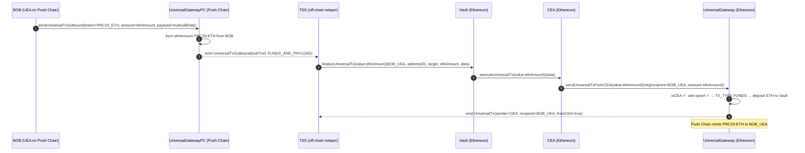

---

### 4.2 FUNDS Native — via CEA Balance + BURN (hybrid)

**Scenario**: CEA holds 0.2 ETH. BOB burns 0.3 PRC20-ETH. CEA combines both (0.5 ETH total)
and bridges all of it back to BOB's UEA.

**Push Chain call**: `amount=0.3 ether, payload=<multicallData>` → `FUNDS_AND_PAYLOAD`.

**Multicall payload**: Same structure as 4.1 but `value: 0.5 ether` in the Multicall —
drawing on Vault-supplied 0.3 ETH plus 0.2 ETH pre-existing in CEA.

```solidity
calls[0] = Multicall({
    to:    UNIVERSAL_GATEWAY,
    value: 0.5 ether,   // 0.3 from Vault + 0.2 pre-existing
    data:  abi.encodeCall(IUniversalGateway.sendUniversalTxFromCEA, (UniversalTxRequest({
        recipient: BOB_UEA, token: address(0), amount: 0.5 ether,
        payload: bytes(""), revertRecipient: BOB_PUSH_ADDRESS, signatureData: bytes("")
    })))
});
```

---

### 4.3 FUNDS Token — via BURN

**Scenario**: BOB burns PRC20-USDC. Vault sends USDC to CEA. CEA approves the gateway and
calls `sendUniversalTxFromCEA` to bridge USDC back to Push Chain.

**Push Chain call**: `token=PRC20_USDC, amount=500e6, payload=<multicallData>` → `FUNDS_AND_PAYLOAD`.

**Multicall payload** (TSS-crafted):
```solidity
Multicall[] memory calls = new Multicall[](2);
// Approve gateway to pull USDC from CEA
calls[0] = Multicall({ to: USDC_ADDRESS, value: 0, data: abi.encodeCall(IERC20.approve, (UNIVERSAL_GATEWAY, 500e6)) });
// Bridge USDC back to Push Chain
calls[1] = Multicall({
    to:    UNIVERSAL_GATEWAY,
    value: 0,
    data:  abi.encodeCall(IUniversalGateway.sendUniversalTxFromCEA, (UniversalTxRequest({
        recipient:       BOB_UEA,
        token:           USDC_ADDRESS,
        amount:          500e6,
        payload:         bytes(""),
        revertRecipient: BOB_PUSH_ADDRESS,
        signatureData:   bytes("")
    })))
});
bytes memory data = abi.encode(calls);
```

Gateway infers `TX_TYPE.FUNDS`. Pulls USDC from CEA via `safeTransferFrom(CEA, Vault, 500e6)`.
Push Chain mints 500 PRC20-USDC to BOB's UEA.

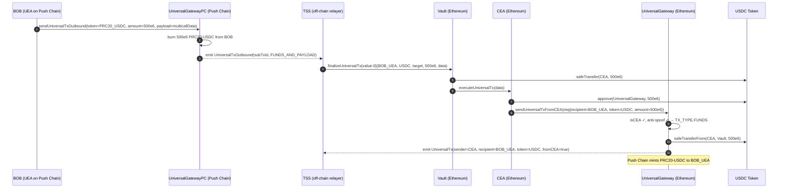

---

### 4.4 FUNDS Token — via CEA Balance + BURN

Same structure as 4.3. CEA already holds some USDC. The multicall approves and bridges
`existingBalance + burnAmount` — the gateway pulls the full combined amount via `safeTransferFrom`.

---

### 4.5 FUNDS_AND_PAYLOAD Native — via BURN

**Scenario**: BOB bridges ETH back to Push Chain AND attaches a payload for his UEA to
execute on Push Chain (e.g., a governance vote or a contract call).

**Push Chain call**: `amount=ethAmount, payload=<multicallData>` → `FUNDS_AND_PAYLOAD`.

**Multicall payload**: Same as 4.1 but with `payload: pushChainPayload` in the inner request.

```solidity
calls[0] = Multicall({
    to:    UNIVERSAL_GATEWAY,
    value: ethAmount,
    data:  abi.encodeCall(IUniversalGateway.sendUniversalTxFromCEA, (UniversalTxRequest({
        recipient:       BOB_UEA,
        token:           address(0),
        amount:          ethAmount,
        payload:         pushChainPayload,   // non-empty → FUNDS_AND_PAYLOAD on external chain
        revertRecipient: BOB_PUSH_ADDRESS,
        signatureData:   bytes("")
    })))
});
```

Gateway infers `TX_TYPE.FUNDS_AND_PAYLOAD`. Epoch rate limit applies.
Push Chain credits BOB's UEA with ETH **and** executes `pushChainPayload` via UEA.

---

### 4.7 FUNDS_AND_PAYLOAD Token — via BURN

Same structure as 4.5 but with ERC20. The multicall includes an approve step before calling
`sendUniversalTxFromCEA`. Gateway pulls tokens via `safeTransferFrom`.

```solidity
Multicall[] memory calls = new Multicall[](2);
calls[0] = Multicall({ to: TOKEN, value: 0, data: abi.encodeCall(IERC20.approve, (GATEWAY, amount)) });
calls[1] = Multicall({
    to:    UNIVERSAL_GATEWAY,
    value: 0,
    data:  abi.encodeCall(IUniversalGateway.sendUniversalTxFromCEA, (UniversalTxRequest({
        recipient: BOB_UEA, token: TOKEN, amount: amount,
        payload: pushChainPayload, revertRecipient: BOB_PUSH_ADDRESS, signatureData: bytes("")
    })))
});
```

---

## 5. Category 4 — Revert Flows

Revert flows return funds to the user when a cross-chain transaction is rejected or fails
after TSS has already taken custody.

---

### 5.1 Revert ERC20 Token

**Scenario**: BOB's USDC withdrawal was rejected on Push Chain. TSS returns the USDC.

**Call chain**:
```
TSS → Vault.revertUniversalTxToken(subTxId, uSubTxId, USDC, amount, revertInstruction)
    → Vault: validate token support + balance, safeTransfer(gateway, amount)
    → gateway.revertUniversalTxToken(...) → safeTransfer(revertRecipient, amount)
    → emit RevertUniversalTx
```

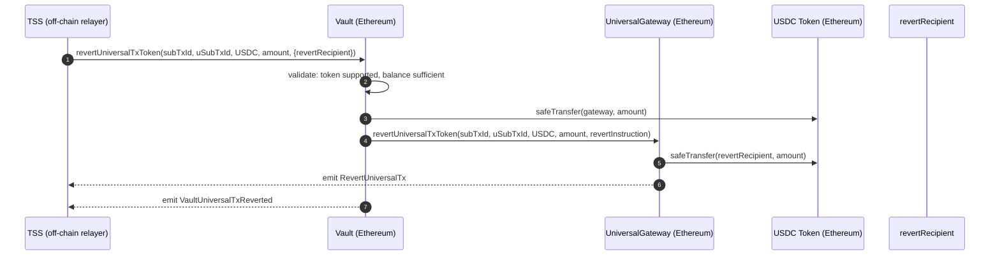

---

### 5.2 Revert Native Token

**Scenario**: BOB's native ETH withdrawal was rejected. ETH is held in the gateway
(deposited during the original inbound `sendUniversalTx` call). TSS calls `revertUniversalTx`
directly — no Vault involvement.

**Call chain**:
```
TSS → UniversalGateway.revertUniversalTx{value: amount}(subTxId, uSubTxId, amount, revertInstruction)
    → gateway: call{value: amount}(revertRecipient)
    → emit RevertUniversalTx
```

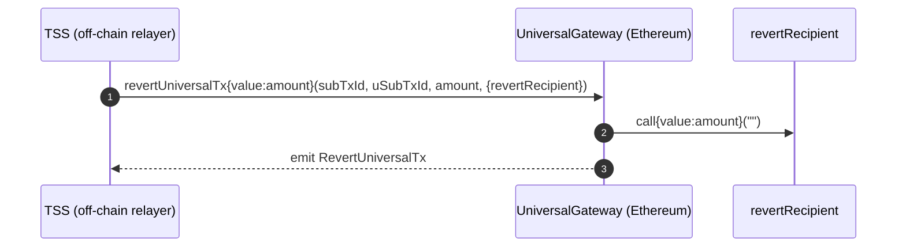

---

## 6. Null Execution (CEA Pre-funding)

A **null execution** is `Vault.finalizeUniversalTx` called with `data = bytes("")`. The CEA
receives tokens or ETH but executes nothing — funds are held in the CEA for later use.

**When TSS uses it**:
- Pre-fund a CEA before the user's actual execution request arrives.
- Stage funds for a multi-step operation where execution happens in a later transaction.

**Later retrieval**: BOB initiates a `GAS_AND_PAYLOAD` outbound. TSS calls
`finalizeUniversalTx` again with a non-empty multicall that draws on the pre-funded CEA
balance (pattern from sections 3.2, 3.5, or any Category 3 flow).

---

## Appendix

### A. Multicall Payload Encoding Reference

```solidity
Multicall[] memory calls = new Multicall[](n);
calls[0] = Multicall({ to: addr0, value: val0, data: calldata0 });
// ...
bytes memory payload = abi.encode(calls);

// Decoding
Multicall[] memory decoded = abi.decode(payload, (Multicall[]));
```

### B. Event Reference

#### `UniversalTxOutbound` (UniversalGatewayPC — Push Chain)
```solidity
event UniversalTxOutbound(
    bytes32 indexed subTxId,
    address indexed sender,       // BOB's UEA address
    string  chainNamespace,       // e.g. "eip155:1" for Ethereum
    address indexed token,        // PRC20 token address
    bytes   target,               // destination address (raw bytes)
    uint256 amount,               // amount burned (0 for GAS_AND_PAYLOAD)
    address gasToken,
    uint256 gasFee,
    uint256 gasLimit,
    bytes   payload,              // empty for FUNDS; non-empty for *_AND_PAYLOAD
    uint256 protocolFee,
    address revertRecipient,
    TX_TYPE txType
);
```

#### `UniversalTx` (UniversalGateway — External Chain)
```solidity
event UniversalTx(
    address indexed sender,       // EOA or CEA address
    address indexed recipient,    // address(0) = sender's UEA; explicit = specific UEA (fromCEA path)
    address token,                // address(0) = native
    uint256 amount,
    bytes   payload,
    address revertRecipient,
    TX_TYPE txType,
    bytes   signatureData,
    bool    fromCEA               // true when called via sendUniversalTxFromCEA
);
```

#### `VaultUniversalTxFinalized` (Vault — External Chain)
```solidity
event VaultUniversalTxFinalized(
    bytes32 indexed subTxId,
    bytes32 indexed universalTxId,
    address indexed pushAccount,  // BOB's UEA
    address target,               // backward-compat metadata only, not used for routing
    address token,
    uint256 amount,
    bytes   data                  // multicall payload: abi.encode(Multicall[])
);
```

### C. TX_TYPE Decision Matrix

#### Push Chain Outbound (`UniversalGatewayPC._fetchTxType`)

| `req.payload.length` | `req.amount` | TX_TYPE             | Burns PRC20 |
| -------------------- | ------------ | ------------------- | ----------- |
| 0                    | > 0          | `FUNDS`             | yes         |
| > 0                  | > 0          | `FUNDS_AND_PAYLOAD` | yes         |
| > 0                  | 0            | `GAS_AND_PAYLOAD`   | no          |
| 0                    | 0            | ❌ `InvalidInput()`  | —           |

#### External Chain — CEA→UEA (`UniversalGateway._fetchTxType` via `sendUniversalTxFromCEA`)

| `req.amount` | `req.payload` | `msg.value` | TX_TYPE             | Active       |
| ------------ | ------------- | ----------- | ------------------- | ------------ |
| > 0          | empty         | == amount   | `FUNDS` (native)    | ✅            |
| > 0          | empty         | 0           | `FUNDS` (ERC20)     | ✅            |
| > 0          | non-empty     | any         | `FUNDS_AND_PAYLOAD` | ✅            |
| 0            | empty         | > 0         | `GAS`               | ❌ not active |
| 0            | non-empty     | any         | `GAS_AND_PAYLOAD`   | ❌ not active |

### D. Security Invariants

| Invariant                     | Enforced in                          | Description                                               |
| ----------------------------- | ------------------------------------ | --------------------------------------------------------- |
| Only TSS can execute          | `Vault.sol:159` `onlyRole(TSS_ROLE)` | No one else can call `finalizeUniversalTx`                |
| Anti-spoof (CEA path)         | `UniversalGateway.sol:359`           | `req.recipient` must equal `getUEAForCEA(CEA)`            |
| No CEA on normal path         | `UniversalGateway.sol:311`           | `sendUniversalTx` blocks CEA callers (`InvalidInput`)     |
| Token/value invariant         | `Vault.sol:207-214`                  | Native: `msg.value == amount`; ERC20: `msg.value == 0`    |
| Token support                 | `Vault.sol:199`                      | All tokens validated via `gateway.isSupportedToken()`     |
| Reentrancy protection         | `nonReentrant` on all entry points   | Prevents re-entrant execution                             |
| Pausable                      | `whenNotPaused` on all entry points  | Emergency halt for Vault, Gateway, GatewayPC              |
| Self-call value block         | `CEA.sol:197`                        | CEA self-calls with `value != 0` are rejected             |
| subTxId replay guard          | `CEA.isExecuted`                     | Each `subTxId` can only execute once                      |
| `target` not used for routing | `Vault.sol:150` NatSpec              | `target` is metadata only; multicall payload routes funds |
