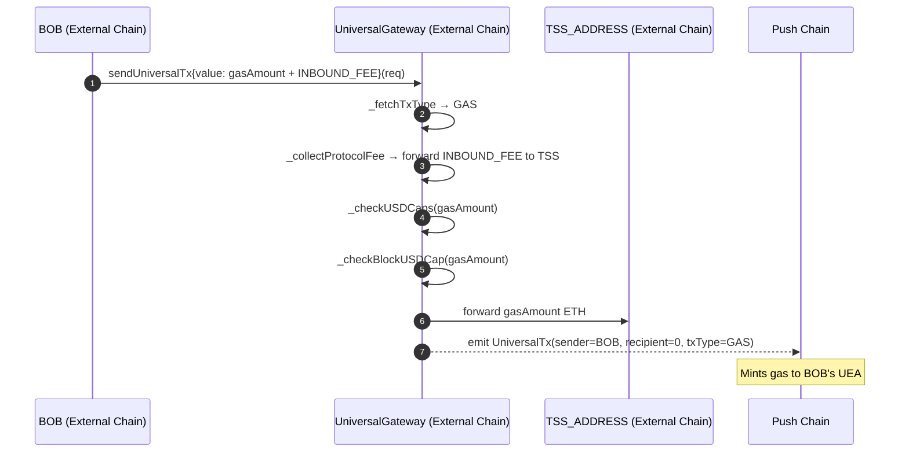
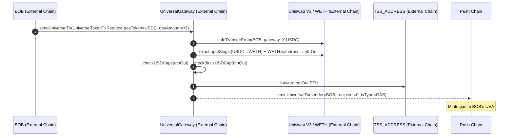
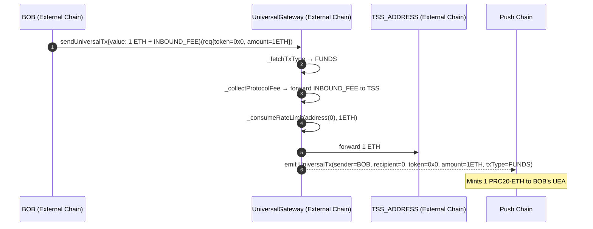
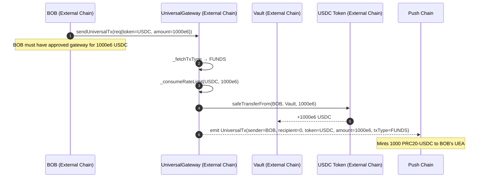
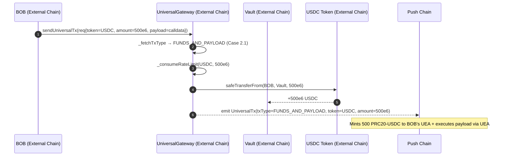
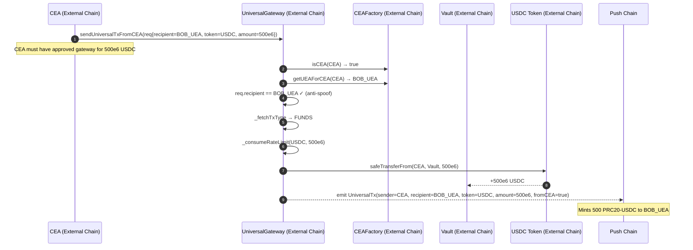

# Inbound Transaction Flows

This document describes all valid inbound transaction flows in the Push Chain gateway architecture.
"Inbound" means: a user on an external EVM chain initiates a transaction that results in funds
or payload delivery on Push Chain.

`UniversalGateway` on the external chain is the sole entry point. It infers the transaction type,
enforces rate limits, moves funds, and emits the `UniversalTx` event that TSS observes to mint
PRC20 or execute UEA payloads on Push Chain.

---

## 1. Architecture Overview

### 1.1 Chain Roles and Contract Placement

| Chain          | Contract           | Role                                                                                   |
| -------------- | ------------------ | -------------------------------------------------------------------------------------- |
| External Chain | `UniversalGateway` | Inbound entry point; infers TX_TYPE; routes gas/funds; handles reverts                 |
| External Chain | `Vault`            | Holds ERC20 funds locked for bridging; receives ERC20 deposits via `safeTransferFrom`  |
| External Chain | `CEAFactory`       | CEA identity registry; used for `sendUniversalTxFromCEA` anti-spoof                    |
| External Chain | `CEA`              | Per-UEA smart contract wallet; can call `sendUniversalTxFromCEA` back into the gateway |
| External Chain | Chainlink Feeds    | ETH/USD price oracle for USD caps; optional L2 sequencer uptime feed                   |
| External Chain | Uniswap V3         | Token→native swap for the `UniversalTokenTxRequest` entry point                        |
| Push Chain     | TSS (off-chain)    | Observes `UniversalTx` events; mints PRC20; executes UEA payloads                      |

### 1.2 Actors

| Actor   | Description                                                                                                                                              |
| ------- | -------------------------------------------------------------------------------------------------------------------------------------------------------- |
| **BOB** | The end user on the external chain. Has a UEA on Push Chain and an associated CEA on the external chain.                                                 |
| **UEA** | BOB's Universal Execution Account on Push Chain — the address funds and payloads are credited to.                                                        |
| **TSS** | Off-chain Threshold Signature Scheme relayer operated by Push Chain validators. Observes `UniversalTx` events; mints PRC20 or executes payloads via UEA. |
| **CEA** | BOB's Chain Execution Account on the external chain. Can call `sendUniversalTxFromCEA` to bridge funds back to Push Chain.                               |

### 1.3 Token Model: Inbound Mint Mechanics

Inbound transactions result in PRC20 minting on Push Chain:

- **Native ETH gas/funds**: Forwarded directly to `TSS_ADDRESS` by `_handleDeposits`
  (`UniversalGateway.sol:732`). TSS observes the `UniversalTx` event and mints PRC20-ETH
  to the recipient UEA.
- **ERC20 funds**: Pulled from the caller into `Vault` via `safeTransferFrom`
  (`UniversalGateway.sol:737`). TSS observes the `UniversalTx` event and mints the
  corresponding PRC20 token to the recipient UEA.
- **`recipient == address(0)`** in `UniversalTx`: Push Chain attributes the inbound tx to
  `sender`'s own UEA.
- **`recipient != address(0)`** (CEA path only): Push Chain routes to that explicit UEA address.

### 1.4 TX_TYPE Reference — Inbound `_fetchTxType` (`UniversalGateway.sol:891-941`)

TX_TYPE is inferred automatically from four decision variables. Users never specify it.

```
hasPayload     := req.payload.length > 0
hasFunds       := req.amount > 0
fundsIsNative  := req.token == address(0)
hasNativeValue := nativeValue > 0   // msg.value or swapped ETH from token-gas path
```

| `hasPayload` | `hasFunds` | `fundsIsNative` | `hasNativeValue` | TX_TYPE                        | Route    |
| ------------ | ---------- | --------------- | ---------------- | ------------------------------ | -------- |
| false        | false      | —               | true             | `GAS`                          | Instant  |
| true         | false      | —               | any              | `GAS_AND_PAYLOAD`              | Instant  |
| false        | true       | true            | true             | `FUNDS`                        | Standard |
| false        | true       | false           | any              | `FUNDS`                        | Standard |
| true         | true       | false           | false            | `FUNDS_AND_PAYLOAD` (Case 2.1) | Standard |
| true         | true       | true            | true             | `FUNDS_AND_PAYLOAD` (Case 2.2) | Standard |
| true         | true       | false           | true             | `FUNDS_AND_PAYLOAD` (Case 2.3) | Standard |
| (any other)  | —          | —               | —                | ❌ reverts `InvalidInput`       | —        |

### 1.5 Protocol Fee

> **Protocol Fee** — see [2_UniversalGateway.md §4 Inbound Fees](./2_UniversalGateway.md).

### 1.6 Rate-Limit Model

| System            | Applies To                   | Mechanism                                                                        |
| ----------------- | ---------------------------- | -------------------------------------------------------------------------------- |
| USD Caps (per-tx) | `GAS`, `GAS_AND_PAYLOAD`     | `_checkUSDCaps`: min/max USD per tx via Chainlink ETH/USD feed (line 718-722)    |
| Block USD Cap     | `GAS`, `GAS_AND_PAYLOAD`     | `_checkBlockUSDCap`: per-block rolling USD budget; resets each block (line 745)  |
| Epoch Rate Limit  | `FUNDS`, `FUNDS_AND_PAYLOAD` | `_consumeRateLimit`: per-token quota; resets after `epochDurationSec` (line 770) |

USD caps apply **only when `nativeValue > 0`**. A `GAS_AND_PAYLOAD` tx with `msg.value == 0`
(payload-only) skips all USD cap checks.

### 1.7 Entry Points

| Function                                     | Caller           | CEA blocked? | Key extra step                              |
| -------------------------------------------- | ---------------- | ------------ | ------------------------------------------- |
| `sendUniversalTx(UniversalTxRequest)`        | Any EOA/contract | Yes          | None                                        |
| `sendUniversalTx(UniversalTokenTxRequest)`   | Any EOA/contract | Yes          | Swap `gasToken` → native via `swapToNative` |
| `sendUniversalTxFromCEA(UniversalTxRequest)` | CEA only         | N/A          | CEA identity check + anti-spoof check       |

CEAs are blocked from calling `sendUniversalTx` directly (reverts `InvalidInput`,
`UniversalGateway.sol:311`). They must use `sendUniversalTxFromCEA`.

---

## 2. Category 1 — Gas Top-Up Flows (TX_TYPE.GAS)

Pure native gas deposit. No funds, no payload. The deposited ETH tops up the caller's UEA
gas balance on Push Chain.

**Invariants**: `req.amount == 0`, `req.payload == ""`, `nativeValue > 0`.

**Rate limits**: USD caps + block USD cap applied to the full `nativeValue`.

**ETH routing**: Forwarded to `TSS_ADDRESS` via `_handleDeposits(address(0), amount)`.

**Event**: `UniversalTx(sender=BOB, recipient=address(0), token=address(0), amount=nativeValue,
payload="", txType=GAS, fromCEA=false)`.

---

### 2.1 Native Gas Top-Up

**Scenario**: BOB sends ETH directly to fund his UEA's gas on Push Chain.

**Call**:
```solidity
UniversalTxRequest({
    recipient:       address(0),   // Push Chain credits BOB's UEA
    token:           address(0),
    amount:          0,
    payload:         bytes(""),
    revertRecipient: BOB_ADDRESS,
    signatureData:   bytes("")
})
// msg.value = gasAmount + INBOUND_FEE (must be within USD caps after fee extraction)
```

**TX_TYPE**: `GAS` (`hasPayload=false`, `hasFunds=false`, `hasNativeValue=true`).



---

### 2.2 Native Gas Top-Up via ERC20 Token Swap

**Scenario**: BOB pays gas in an ERC20 token (e.g. USDC). The gateway swaps it to native ETH
first, then processes it identically to 2.1.

**Call**: `sendUniversalTx(UniversalTokenTxRequest)` with `gasToken=USDC`, `gasAmount=X`,
`amountOutMinETH=Y` (slippage bound), `deadline=T`. The `amount` and `token` fields are 0/empty
for a pure gas top-up.

**Swap path** (`swapToNative`, `UniversalGateway.sol:802-853`):
1. If `gasToken == WETH`: pull WETH from BOB, unwrap to ETH (fast-path).
2. Otherwise: scan `v3FeeOrder` fee tiers for a `gasToken/WETH` pool, pull `gasToken` from BOB,
   call `uniV3Router.exactInputSingle`, unwrap WETH to ETH.
3. Enforce `ethOut >= amountOutMinETH`.

**After swap**: `nativeValue = ethOut`. TX_TYPE inference proceeds identically to 2.1.

**Key validations** (`UniversalGateway.sol:321-324`):
- `gasToken != address(0)`
- `gasAmount > 0`
- `amountOutMinETH > 0`
- `deadline == 0 OR deadline >= block.timestamp`



---

## 3. Category 2 — Payload Execution Flows (TX_TYPE.GAS_AND_PAYLOAD)

`req.payload.length > 0`, `req.amount == 0`. USD caps applied only when `nativeValue > 0`.

**TX_TYPE**: `GAS_AND_PAYLOAD` (`hasPayload=true`, `hasFunds=false`).

The payload is forwarded to Push Chain for execution via BOB's UEA. No funds are bridged.

---

### 3.1 Payload-Only (no gas top-up)

**Scenario**: BOB submits a payload to execute on Push Chain but provides no ETH. BOB's UEA
must already have gas on Push Chain.

**Call**: `sendUniversalTx(req)` with `payload=<pushChainCalldata>`, `msg.value=INBOUND_FEE`
(or `0` if fee is disabled).

**Rate limits**: No USD cap or block cap check (skipped when post-fee `nativeValue == 0`,
`UniversalGateway.sol:392`).

**Event**: `UniversalTx(sender=BOB, recipient=address(0), token=address(0), amount=0,
payload=<calldata>, txType=GAS_AND_PAYLOAD, fromCEA=false)`.

---

### 3.2 Payload + Gas Top-Up

**Scenario**: BOB submits a payload and also tops up his UEA's gas in one transaction.

**Call**: `sendUniversalTx(req)` with `payload=<calldata>`, `msg.value=gasAmount + INBOUND_FEE`.

**Rate limits**: USD caps + block cap checked on post-fee `gasAmount`.

**Event**: `UniversalTx(amount=gasAmount, txType=GAS_AND_PAYLOAD)`.

---

### 3.3 Payload via ERC20 Token Swap

Same as 3.1 or 3.2 but uses `sendUniversalTx(UniversalTokenTxRequest)`. The `gasToken` is
swapped to native (`ethOut`). If `ethOut > 0`, acts as 3.2; the gas portion is forwarded to
TSS.

---

## 4. Category 3 — Fund Transfer Flows (TX_TYPE.FUNDS)

`req.amount > 0`, `req.payload == ""`. Epoch rate-limit consumed via `_consumeRateLimit`.

**Standard route**: higher block confirmation requirement compared to GAS routes.

---

### 4.1 Native FUNDS Transfer

**Scenario**: BOB bridges ETH from the external chain to Push Chain. TSS mints PRC20-ETH to
BOB's UEA.

**Call**:
```solidity
UniversalTxRequest({
    recipient:       address(0),
    token:           address(0),      // native
    amount:          1 ether,
    payload:         bytes(""),
    revertRecipient: BOB_ADDRESS,
    signatureData:   bytes("")
})
// msg.value must equal req.amount + INBOUND_FEE
```

**TX_TYPE**: `FUNDS` (`hasFunds=true`, `hasPayload=false`, `fundsIsNative=true`, `hasNativeValue=true`).

**Validation** (`UniversalGateway.sol:419`): After fee extraction, `req.amount != nativeValue`
→ revert `InvalidAmount`. Since `nativeValue = msg.value - INBOUND_FEE`, this means
`msg.value` must equal `req.amount + INBOUND_FEE` exactly.

**Routing**:
1. `_consumeRateLimit(address(0), req.amount)` — consume native epoch quota.
2. `_handleDeposits(address(0), req.amount)` — forward ETH to `TSS_ADDRESS`.
3. Emit `UniversalTx(txType=FUNDS)`.



---

### 4.2 ERC20 FUNDS Transfer (No Gas Batching)

**Scenario**: BOB bridges ERC20 tokens (e.g. USDC) from the external chain to Push Chain.
No gas top-up needed — BOB's UEA already has gas on Push Chain.

**Call**: `req.token = USDC_ADDRESS`, `req.amount = 1000e6`, `msg.value = 0` (or `INBOUND_FEE`
if fee is enabled).

**TX_TYPE**: `FUNDS` (`hasFunds=true`, `hasPayload=false`, `fundsIsNative=false`).

**Token support check** (`UniversalGateway.sol:736`): `tokenToLimitThreshold[token] == 0`
→ revert `NotSupported`. Token must be in the allowlist.

**Routing** (Case 1.2, `nativeValue == 0` post-fee):
1. `_consumeRateLimit(USDC, 1000e6)` — consume USDC epoch quota.
2. `_handleDeposits(USDC, 1000e6)` — `safeTransferFrom(BOB, Vault, 1000e6)`.
3. Emit `UniversalTx(txType=FUNDS, token=USDC)`.



---

### 4.3 ERC20 FUNDS + Native Gas Batching

**Scenario**: BOB bridges ERC20 tokens and also tops up his UEA's gas in a single transaction.

**Call**: `req.token = USDC_ADDRESS`, `req.amount = 1000e6`, `msg.value = gasTopUp`
(or `gasTopUp + INBOUND_FEE` if fee is enabled).

**TX_TYPE**: `FUNDS` (`hasFunds=true`, `hasPayload=false`, `fundsIsNative=false`).

**Routing** (Case 1.2, `nativeValue > 0` post-fee):
1. `_sendTxWithGas(GAS, gasTopUp)` → USD caps + block cap checked → forward gas ETH to TSS →
   emit **first** `UniversalTx(txType=GAS, amount=gasTopUp)`.
2. `_consumeRateLimit(USDC, 1000e6)` — consume USDC epoch quota.
3. `_handleDeposits(USDC, 1000e6)` — `safeTransferFrom(BOB, Vault, 1000e6)`.
4. Emit **second** `UniversalTx(txType=FUNDS, token=USDC, amount=1000e6)`.

**Total events**: 2 (gas leg + funds leg).

```mermaid
sequenceDiagram
    autonumber
    participant BOB as BOB (External Chain)
    participant GW as UniversalGateway (External Chain)
    participant V as Vault (External Chain)
    participant USDC as USDC Token (External Chain)
    participant TSS as TSS_ADDRESS (External Chain)
    participant PC as Push Chain

    BOB->>GW: sendUniversalTx{value: gasTopUp}(req{token=USDC, amount=1000e6})
    GW->>GW: _fetchTxType → FUNDS
    GW->>GW: _checkUSDCaps(gasTopUp), _checkBlockUSDCap(gasTopUp)
    GW->>TSS: forward gasTopUp ETH (gas leg)
    GW-->>PC: emit UniversalTx(txType=GAS, amount=gasTopUp) [gas leg]
    GW->>GW: _consumeRateLimit(USDC, 1000e6)
    GW->>USDC: safeTransferFrom(BOB, Vault, 1000e6)
    USDC-->>V: +1000e6 USDC
    GW-->>PC: emit UniversalTx(txType=FUNDS, token=USDC, amount=1000e6) [funds leg]
    Note over PC: gasTopUp tops UEA gas; 1000 USDC minted as PRC20-USDC
```

---

### 4.4 ERC20 FUNDS via Token Swap

Uses `sendUniversalTx(UniversalTokenTxRequest)`. The `gasToken` is swapped to native ETH
(`ethOut`) via `swapToNative`. After protocol fee extraction, the remaining `nativeValue`
becomes a gas top-up (Section 4.3 pattern). The ERC20 `token`/`amount` fields identify the
funds being bridged.

**Routing**: identical to 4.3 — post-fee `nativeValue` is routed as gas via `_sendTxWithGas`,
ERC20 amount goes to Vault via `_handleDeposits`.

---

## 5. Category 4 — Funds + Payload Flows (TX_TYPE.FUNDS_AND_PAYLOAD)

`req.amount > 0`, `req.payload.length > 0`. Epoch rate-limit consumed. Standard route.

Three sub-cases are determined inside `_sendTxWithFunds` (`UniversalGateway.sol:459-525`)
based on `req.token` and `nativeValue`.

---

### 5.1 Case 2.1 — ERC20 Funds, No Gas Batching

**Condition**: `req.token != address(0)`, `nativeValue == 0` (no ETH sent).

**Scenario**: BOB bridges USDC and includes a Push Chain payload. BOB already has gas on Push
Chain — no gas top-up needed.

**Call**: `req.token=USDC`, `req.amount=500e6`, `req.payload=<calldata>`, `msg.value=0`
(or `INBOUND_FEE` if fee is enabled).

**TX_TYPE**: `FUNDS_AND_PAYLOAD` Case 2.1 (`hasPayload=true`, `hasFunds=true`,
`fundsIsNative=false`, `hasNativeValue=false`).

**Routing**:
1. `_consumeRateLimit(USDC, 500e6)`.
2. `_handleDeposits(USDC, 500e6)` → `safeTransferFrom(BOB, Vault, 500e6)`.
3. Emit **one** `UniversalTx(txType=FUNDS_AND_PAYLOAD, token=USDC, amount=500e6, payload=...)`.



---

### 5.2 Case 2.2 — Native Funds + Native Gas Batching

**Condition**: `req.token == address(0)`, `nativeValue > 0`.

**Scenario**: BOB sends 1.1 ETH — 1 ETH is bridged to Push Chain, 0.1 ETH tops up UEA gas.
Both happen in a single transaction.

**Call**: `req.token=address(0)`, `req.amount=1 ether`, `msg.value=1.1 ether + INBOUND_FEE`.

**Invariant** (`UniversalGateway.sol:473`): post-fee `nativeValue >= req.amount`. If
`nativeValue < req.amount` → revert `InvalidAmount`.

**Routing**:
1. `gasAmount = nativeValue - req.amount` = 0.1 ETH.
2. If `gasAmount > 0`: call `_sendTxWithGas(GAS, gasAmount)` → USD caps + block cap checked →
   forward gas ETH to TSS → emit **first** `UniversalTx(txType=GAS, amount=0.1ETH)`.
3. `_consumeRateLimit(address(0), 1 ETH)`.
4. `_handleDeposits(address(0), 1 ETH)` → forward 1 ETH to TSS.
5. Emit **second** `UniversalTx(txType=FUNDS_AND_PAYLOAD, amount=1ETH)`.

**Total events**: 2 (or 1 if `gasAmount == 0` because `msg.value == req.amount`).

```mermaid
sequenceDiagram
    autonumber
    participant BOB as BOB (External Chain)
    participant GW as UniversalGateway (External Chain)
    participant TSS as TSS_ADDRESS (External Chain)
    participant PC as Push Chain

    BOB->>GW: sendUniversalTx{value: 1.1 ETH + INBOUND_FEE}(req{token=0x0, amount=1ETH, payload=calldata})
    GW->>GW: _fetchTxType → FUNDS_AND_PAYLOAD (Case 2.2)
    GW->>GW: _collectProtocolFee → forward INBOUND_FEE to TSS
    GW->>GW: gasAmount = 1.1 - 1.0 = 0.1 ETH (post-fee nativeValue = 1.1)
    GW->>GW: _checkUSDCaps(0.1 ETH), _checkBlockUSDCap(0.1 ETH)
    GW->>TSS: forward 0.1 ETH (gas leg)
    GW-->>PC: emit UniversalTx(txType=GAS, amount=0.1ETH) [gas leg]
    GW->>GW: _consumeRateLimit(address(0), 1ETH)
    GW->>TSS: forward 1 ETH (funds leg)
    GW-->>PC: emit UniversalTx(txType=FUNDS_AND_PAYLOAD, amount=1ETH) [funds leg]
    Note over PC: 0.1 ETH tops UEA gas; 1 ETH minted as PRC20-ETH + payload executed
```

---

### 5.3 Case 2.3 — ERC20 Funds + Native Gas Batching

**Condition**: `req.token != address(0)`, `nativeValue > 0`.

**Scenario**: BOB sends 0.01 ETH for gas and bridges 500 USDC with a payload, all in one call.

**Call**: `req.token=USDC`, `req.amount=500e6`, `req.payload=<calldata>`,
`msg.value=0.01 ether + INBOUND_FEE`.

**Routing**:
1. `gasAmount = nativeValue` = 0.01 ETH (entire native value is the gas leg).
2. `_sendTxWithGas(GAS, 0.01 ETH)` → USD caps + block cap → forward to TSS →
   emit **first** `UniversalTx(txType=GAS, amount=0.01ETH)`.
3. `_consumeRateLimit(USDC, 500e6)`.
4. `_handleDeposits(USDC, 500e6)` → `safeTransferFrom(BOB, Vault, 500e6)`.
5. Emit **second** `UniversalTx(txType=FUNDS_AND_PAYLOAD, token=USDC, amount=500e6)`.

**Total events**: Always 2.

```mermaid
sequenceDiagram
    autonumber
    participant BOB as BOB (External Chain)
    participant GW as UniversalGateway (External Chain)
    participant V as Vault (External Chain)
    participant USDC as USDC Token (External Chain)
    participant TSS as TSS_ADDRESS (External Chain)
    participant PC as Push Chain

    BOB->>GW: sendUniversalTx{value: 0.01ETH + INBOUND_FEE}(req{token=USDC, amount=500e6, payload=calldata})
    GW->>GW: _fetchTxType → FUNDS_AND_PAYLOAD (Case 2.3)
    GW->>GW: _collectProtocolFee → forward INBOUND_FEE to TSS
    GW->>GW: _checkUSDCaps(0.01ETH), _checkBlockUSDCap(0.01ETH)
    GW->>TSS: forward 0.01 ETH (gas leg)
    GW-->>PC: emit UniversalTx(txType=GAS, amount=0.01ETH) [gas leg]
    GW->>GW: _consumeRateLimit(USDC, 500e6)
    GW->>USDC: safeTransferFrom(BOB, Vault, 500e6)
    USDC-->>V: +500e6 USDC
    GW-->>PC: emit UniversalTx(txType=FUNDS_AND_PAYLOAD, token=USDC, amount=500e6) [funds leg]
    Note over PC: 0.01 ETH tops UEA gas; 500 USDC minted as PRC20-USDC + payload executed
```

---

### 5.4 All Cases via Token Swap

Any of the above sub-cases can use `sendUniversalTx(UniversalTokenTxRequest)`. The `gasToken`
is swapped to native first, producing `nativeValue = ethOut`. TX_TYPE inference and routing
then proceeds identically to 5.1, 5.2, or 5.3 depending on `req.token` and `ethOut`.

---

## 6. Category 5 — CEA Self-Call Flows (sendUniversalTxFromCEA)

A CEA calls back into the gateway to bridge funds or execute payloads toward Push Chain.
This path is used when an outbound execution on the external chain needs to return funds
or results to the user's UEA on Push Chain.

All four TX_TYPEs are supported. TX_TYPE inference is identical to the normal path. All events
emit `fromCEA=true` and `recipient=mappedUEA`.

**Protocol fee is skipped** for CEA calls (`fromCEA=true`). The fee is already paid on Push
Chain before the CEA executes on the external chain. CEAs send `msg.value` without adding
`INBOUND_FEE` on top.

### 6.1 Entry Point Checks (`UniversalGateway.sol:352-364`)

```
1. CEA_FACTORY != address(0)                        — factory must be configured
2. ICEAFactory(CEA_FACTORY).isCEA(msg.sender)       — caller must be a deployed CEA
3. mappedUEA = ICEAFactory.getUEAForCEA(msg.sender) — must not be address(0)
4. req.recipient == mappedUEA                        — anti-spoof: prevents crediting arbitrary UEAs
```

If any check fails → revert `InvalidInput` (checks 1-3) or `InvalidRecipient` (check 4).

### 6.2 Why `fromCEA=true` Matters on the Gas Leg

In FUNDS_AND_PAYLOAD Cases 2.2 and 2.3, the gas leg is emitted as a separate `UniversalTx`
event with a `recipient` field.

- **Normal path** (`fromCEA=false`): `gasRecipient = address(0)`. Push Chain attributes gas to
  `msg.sender`'s UEA — which is the CEA's address, not BOB's UEA. This would cause Push Chain
  to deploy a new UEA for the CEA address rather than crediting BOB's existing UEA.
- **CEA path** (`fromCEA=true`): `gasRecipient = req.recipient = mappedUEA`. Push Chain routes
  the gas to BOB's correct UEA.

This logic is applied at `UniversalGateway.sol:464` and `UniversalGateway.sol:513`.

### 6.3 GAS via CEA

Same as Section 2.1 but `fromCEA=true`, `recipient=mappedUEA`.

### 6.4 GAS_AND_PAYLOAD via CEA

Same as Sections 3.1/3.2 but `fromCEA=true`, `recipient=mappedUEA`.

### 6.5 FUNDS via CEA — ERC20 (Detailed Example)

**Scenario**: CEA bridges USDC back to BOB's UEA on Push Chain.



### 6.6 FUNDS_AND_PAYLOAD via CEA

Same as Sections 5.1–5.3 with `fromCEA=true` propagated to both legs (gas leg and funds+payload
leg). Both emitted events carry `recipient=mappedUEA` and `fromCEA=true`.

---

## 7. Category 6 — Revert Flows

> Revert and rescue flows are documented in [Revert_Handling.md](./Revert_Handling.md).

---

## 8. Oracle and Safety Internals (Reference)

### 8.1 Chainlink ETH/USD Feed (`getEthUsdPrice`, `UniversalGateway.sol:627-674`)

Safety checks applied on every price read:
- `priceInUSD <= 0` → revert `InvalidData`
- `answeredInRound < roundId` → revert `InvalidData` (incomplete round)
- `block.timestamp - updatedAt > chainlinkStalePeriod` → revert `InvalidData` (stale)
- Price scaled from Chainlink decimals (typically 8) to 1e18

Output: `price1e18 = USD(1e18) per 1 ETH`. Example: ETH at $4,400 → returns `4_400 * 1e18`.

### 8.2 L2 Sequencer Uptime

If `l2SequencerFeed` is set, `getEthUsdPrice` also checks:
- `status == 1` (DOWN) → revert `InvalidData`
- `block.timestamp - sequencerUpdatedAt <= l2SequencerGracePeriodSec` → revert `InvalidData`

This gates all GAS/GAS_AND_PAYLOAD routes on sequencer liveness. Prevents USD cap exploitation
during sequencer downtime recovery.

### 8.3 `swapToNative` (`UniversalGateway.sol:802-853`)

| Step | Action                                                                            |
| ---- | --------------------------------------------------------------------------------- |
| 1    | If `tokenIn == WETH`: pull WETH, call `WETH.withdraw`, return ETH                 |
| 2    | Else: call `_findV3PoolWithNative(tokenIn)` — scans `v3FeeOrder` fee tiers        |
| 3    | Pull `tokenIn` from caller, approve router, call `exactInputSingle(tokenIn→WETH)` |
| 4    | Reset router allowance to 0, call `WETH.withdraw(wethOut)`                        |
| 5    | Enforce `ethOut >= amountOutMinETH` (slippage bound)                              |

The `receive()` function (`UniversalGateway.sol:980-983`) only accepts ETH from `WETH`. All
other ETH transfers revert, preventing accidental deposits.

---

## 9. Events Reference

### `UniversalTx` (emitted on every inbound path)

```solidity
event UniversalTx(
    address indexed sender,       // caller on the external chain
    address indexed recipient,    // address(0) → Push Chain credits sender's UEA
                                  // mappedUEA  → explicit UEA routing (CEA path only)
    address token,                // address(0) for native; ERC20 address for token
    uint256 amount,               // wei for native; token units for ERC20
    bytes payload,                // Push Chain calldata (empty for funds-only)
    address revertRecipient,      // where funds go if Push Chain rejects the tx
    TX_TYPE txType,               // GAS | GAS_AND_PAYLOAD | FUNDS | FUNDS_AND_PAYLOAD
    bytes signatureData,          // optional signature for signed-verification flows
    bool fromCEA                  // true only on sendUniversalTxFromCEA path
)
```

### `RevertUniversalTx` (emitted on revert paths)

```solidity
event RevertUniversalTx(
    bytes32 indexed subTxId,
    bytes32 indexed universalTxId,
    address indexed to,               // revertRecipient
    address token,                    // address(0) for native
    uint256 amount,
    RevertInstructions revertInstruction
)
```

**`recipient == address(0)` convention**: When `recipient` is `address(0)` in `UniversalTx`,
Push Chain derives the target UEA from `sender` (i.e. BOB's UEA is looked up by his external
chain address). When `recipient` is non-zero (CEA path), Push Chain routes directly to that
address without derivation.

---

## 10. Full Flow Reference Table

All `msg.value` amounts shown below are **pre-fee** (raw `msg.value`). When `INBOUND_FEE > 0`,
add `INBOUND_FEE` to each `msg.value` shown. CEA path (`5.x`) is exempt from the fee.

| #   | TX_TYPE                   | Entry Point                      | `req.token`  | `msg.value` (pre-fee) | Rate Limit                       | Events Emitted         |
| --- | ------------------------- | -------------------------------- | ------------ | --------------------- | -------------------------------- | ---------------------- |
| 1.1 | `GAS`                     | `sendUniversalTx` (native)       | `address(0)` | > 0                   | USD caps + block cap             | 1× `UniversalTx`       |
| 1.2 | `GAS`                     | `sendUniversalTx` (token swap)   | any → native | 0                     | USD caps + block cap on `ethOut` | 1× `UniversalTx`       |
| 2.1 | `GAS_AND_PAYLOAD`         | `sendUniversalTx` (native)       | `address(0)` | ≥ 0                   | USD caps if `msg.value > 0`      | 1× `UniversalTx`       |
| 2.2 | `GAS_AND_PAYLOAD`         | `sendUniversalTx` (token swap)   | any → native | 0                     | USD caps if `ethOut > 0`         | 1× `UniversalTx`       |
| 3.1 | `FUNDS`                   | `sendUniversalTx` (native)       | `address(0)` | == amount             | Epoch (native)                   | 1× `UniversalTx`       |
| 3.2 | `FUNDS`                   | `sendUniversalTx` (native)       | ERC20        | ≥ 0                   | Epoch (token) + USD if gas > 0   | 1–2× `UniversalTx`     |
| 4.1 | `FUNDS_AND_PAYLOAD` (2.1) | `sendUniversalTx`                | ERC20        | 0                     | Epoch (token)                    | 1× `UniversalTx`       |
| 4.2 | `FUNDS_AND_PAYLOAD` (2.2) | `sendUniversalTx`                | `address(0)` | ≥ amount              | Epoch (native) + USD if gas > 0  | 1–2× `UniversalTx`     |
| 4.3 | `FUNDS_AND_PAYLOAD` (2.3) | `sendUniversalTx`                | ERC20        | > 0                   | Epoch (token) + USD caps         | 2× `UniversalTx`       |
| 5.x | Any of above              | `sendUniversalTxFromCEA`         | any          | any (no fee)          | Same as above                    | Same + `fromCEA=true`  |
| 6.1 | —                         | `revertUniversalTxToken` (VAULT) | ERC20        | 0                     | None                             | 1× `RevertUniversalTx` |
| 6.2 | —                         | `revertUniversalTx` (TSS)        | `address(0)` | == amount             | None                             | 1× `RevertUniversalTx` |
