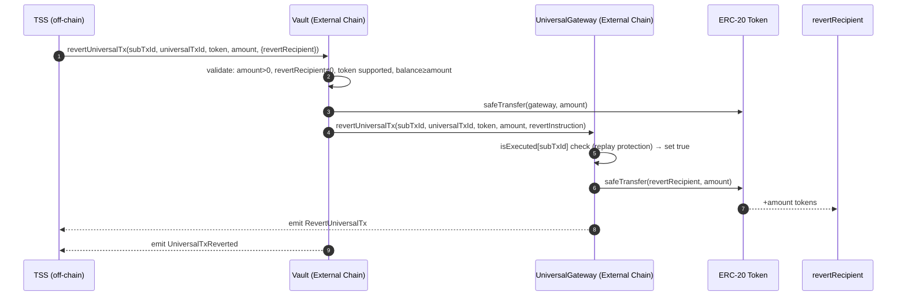
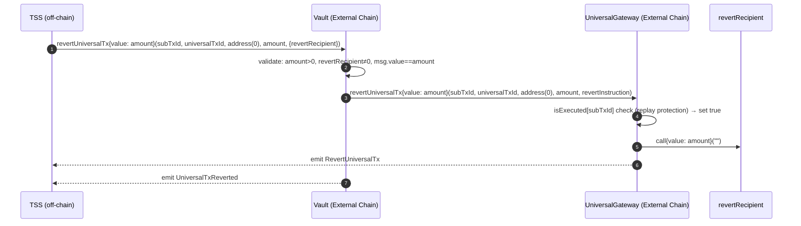
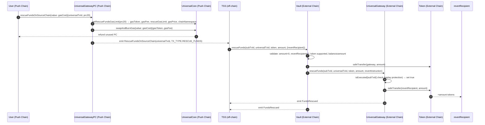

# Revert Handling

This document covers all paths for returning funds to users when a bridging transaction fails or needs to be reversed after the gateway has taken custody of the funds.

---

## 1. Overview — Two Types of Reverts

| Type | Trigger | Applies to |
|------|---------|------------|
| **Auto Revert** | TSS (automatic, off-chain detection) | All inbound `sendUniversalTx` paths |
| **Manual Rescue** | User-initiated on Push Chain | Funds locked via `sendUniversalTxFromCEA` (edge case) |

Outbound reverts (Push Chain → external chain) are handled entirely on Push Chain by UniversalCore and are not covered here.

---

## 2. Auto Revert (Inbound — Standard Path)

### 2.1 When it applies

Any inbound transaction initiated via `sendUniversalTx` or `sendUniversalTxFromCEA` can be auto-reverted if:
- Push Chain rejects the transaction (e.g., UEA execution fails, invalid payload, unsupported operation).
- TSS determines the funds cannot be credited and initiates a revert.

This is the normal, expected revert path for all standard bridging operations.

### 2.2 How fees are covered

The inbound protocol fee (`INBOUND_FEE`) is collected from `msg.value` at the time of the original deposit. This fee covers the cost of the revert operation — no additional payment is required from the user when their funds are returned.

### 2.3 Unified Revert Function

Both ERC-20 and native ETH reverts use a single function on each contract:

- **Vault**: `revertUniversalTx` (`Vault.sol:139`)
- **Gateway**: `revertUniversalTx` (`UniversalGateway.sol:559`)

The Vault's function handles the token/ETH branching before forwarding to the Gateway. The Gateway's function performs replay protection and final transfer to the revert recipient.

### 2.4 ERC-20 Revert Flow

**Actors**: TSS → Vault → UniversalGateway → revertRecipient

**Call chain**:
1. TSS calls `Vault.revertUniversalTx(subTxId, universalTxId, token, amount, revertInstruction)`.
2. Vault validates: `amount > 0`, `revertRecipient != address(0)`, token is supported, `IERC20(token).balanceOf(vault) >= amount`.
3. Vault calls `IERC20(token).safeTransfer(gateway, amount)`.
4. Vault calls `gateway.revertUniversalTx(subTxId, universalTxId, token, amount, revertInstruction)`.
5. Gateway checks `isExecuted[subTxId]` — reverts `PayloadExecuted` if already processed (replay protection).
6. Gateway sets `isExecuted[subTxId] = true`.
7. Gateway calls `IERC20(token).safeTransfer(revertRecipient, amount)`.
8. Gateway emits `RevertUniversalTx`. Vault emits `UniversalTxReverted`.



### 2.5 Native ETH Revert Flow

**Actors**: TSS → Vault → UniversalGateway → revertRecipient

For native ETH, TSS sends `msg.value == amount` with the Vault call. The Vault forwards the ETH value directly to the Gateway call, and the Gateway forwards it to the revert recipient via `.call{value: amount}`.

**Call chain**:
1. TSS calls `Vault.revertUniversalTx{value: amount}(subTxId, universalTxId, address(0), amount, revertInstruction)`.
2. Vault validates: `amount > 0`, `revertRecipient != address(0)`, `msg.value == amount`.
3. Vault calls `gateway.revertUniversalTx{value: amount}(...)`.
4. Gateway checks `isExecuted[subTxId]` → sets `true`.
5. Gateway calls `payable(revertRecipient).call{value: amount}("")` — reverts `WithdrawFailed` on failure.
6. Gateway emits `RevertUniversalTx`. Vault emits `UniversalTxReverted`.



---

## 3. Manual Revert — `rescueFunds` (Edge Case)

### 3.1 When it applies

This path handles an edge case: funds were locked in a source chain Vault via `sendUniversalTxFromCEA` but were **never minted on Push Chain** (e.g., the CEA bridging call was made but the inbound transaction was never picked up or credited).

Anyone who holds the `universalTxId` can trigger this path from Push Chain. Unlike auto-revert, this requires the user to actively initiate the rescue and pay the gas fee.

### 3.2 Trigger Path

**Step 1: User calls `UGPC.rescueFundsOnSourceChain` on Push Chain** (`UniversalGatewayPC.sol:144`)

```solidity
rescueFundsOnSourceChain(bytes32 universalTxId, address prc20) external payable
```

- `prc20` must be non-zero (identifies the token and resolves the source chain).
- Calls `IUniversalCore(UNIVERSAL_CORE).getRescueFundsGasLimit(prc20)` to obtain: `gasToken`, `gasFee`, `rescueGasLimit`, `gasPrice`, `chainNamespace`.
- All of `msg.value` goes to `_swapAndCollectFees(gasToken, msg.value, gasFee)` — no protocol fee split.
- Emits `RescueFundsOnSourceChain(universalTxId, prc20, chainNamespace, msg.sender, TX_TYPE.RESCUE_FUNDS, gasFee, gasPrice, rescueGasLimit)`.

**Step 2: TSS observes the event and calls `Vault.rescueFunds` on the source chain** (`Vault.sol:171`)

Same signature as `revertUniversalTx` but named `rescueFunds`. Same token/ETH branching and validation. Calls `gateway.rescueFunds(...)` after transferring tokens to the Gateway.

**Step 3: Gateway completes the rescue** (`UniversalGateway.sol:581`)

Same replay-protection and transfer logic as `revertUniversalTx`. Emits `FundsRescued` (instead of `RevertUniversalTx`).



### 3.3 Key Differences vs Auto Revert

| Property | Auto Revert | Manual Rescue |
|----------|-------------|---------------|
| Trigger | TSS (automatic) | Anyone with `universalTxId` |
| Applies to | All inbound `sendUniversalTx` paths | `sendUniversalTxFromCEA` edge case |
| Fee | Covered by `INBOUND_FEE` already collected | Caller pays gas in native PC |
| Protocol fee | N/A | None (no protocol fee split) |
| Push Chain entry point | N/A (TSS-initiated directly) | `UGPC.rescueFundsOnSourceChain` |
| Source chain entry point | `Vault.revertUniversalTx` | `Vault.rescueFunds` |
| Gateway function | `UniversalGateway.revertUniversalTx` | `UniversalGateway.rescueFunds` |
| Event emitted (Gateway) | `RevertUniversalTx` | `FundsRescued` |

---

## 4. Replay Protection

Both revert paths share the same replay protection mechanism:

```solidity
// In _validateRevertParams (UniversalGateway.sol:601-607)
if (isExecuted[subTxId]) revert Errors.PayloadExecuted();
isExecuted[subTxId] = true;
```

`subTxId` is marked as executed on the **first** successful revert or rescue call. Any subsequent call with the same `subTxId` reverts `PayloadExecuted`, preventing double-refunds.

---

## 5. Access Control

| Function | Allowed Caller | Mechanism |
|----------|---------------|-----------|
| `Vault.revertUniversalTx` | TSS only | `onlyRole(TSS_ROLE)` |
| `Vault.rescueFunds` | TSS only | `onlyRole(TSS_ROLE)` |
| `UniversalGateway.revertUniversalTx` | Vault only | `onlyRole(VAULT_ROLE)` |
| `UniversalGateway.rescueFunds` | Vault only | `onlyRole(VAULT_ROLE)` |
| `UGPC.rescueFundsOnSourceChain` | Anyone | No role restriction |

The Vault acts as a trusted intermediary: TSS triggers the Vault, the Vault validates state and balances, then calls the Gateway. This prevents TSS from bypassing Vault-level checks.
